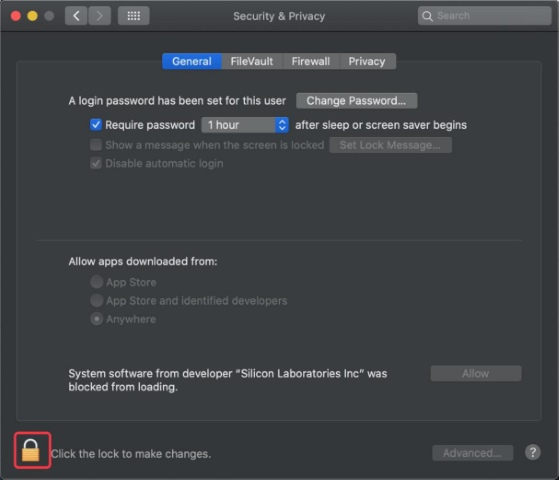
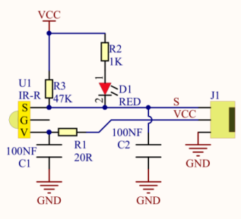
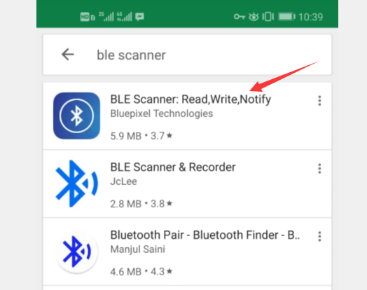
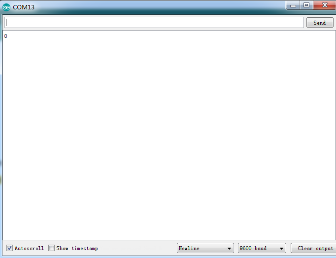
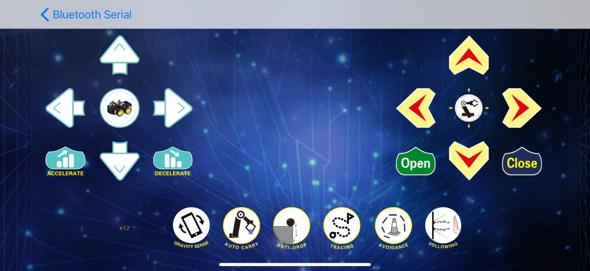
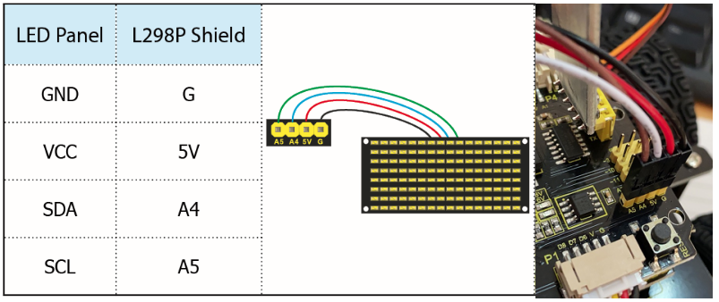

# 4WD BT Multi-purpose Car V2.0 Kit Arduino Tutorial


# Read me first

**Online Wiki page:** [**https://docs.keyestudio.com/projects/KS0470/en/latest/**](https://docs.keyestudio.com/projects/KS0470/en/latest/)**,**

**Download the APP, Code and library :** [**https://fs.keyestudio.com/KS0470**](https://fs.keyestudio.com/KS0470)**,**

**Official website:** [**https://keyestudio.com/**](https://keyestudio.com/)

**Note: Experiments should be conducted in line with the wiring diagram, including the use of right components and the wiring methods. For example, the supply power applied in the hook-up diagram is external power , so you will have to use external power rather than USB cable .**

# Introduction

Modern society is being driven at an astonishing pace by technological advancements, and STEM education (integrated education in Science, Technology, Engineering, and Mathematics) is receiving increasing attention as a key way to cultivate the next generation of innovative talent.

Arduino, as a tool that bridges programming study, hardware operation, and creative realization, is undoubtedly an ideal platform for STEM education. It not only serves as a programming and hardware learning environment but also inspires student creativity and sparks enthusiasm for learning.

The keyestudio 4WD Car offers up to 15 learning projects, with difficulties progressing step by step. These range from simple sensor applications to building a complex four-wheel-drive smart robot, helping students systematically understand the principles and real-world applications of sensors and hardware modules.

# 2. Features

1.  Multi-purpose function: Obstacle avoidance, following, IR remote control, Bluetooth control, ultrasonic following and facial emoticons display.
2.  Easy to build: No soldering circuit required, complete assembly easily.
3.  High Tenacity: Aluminum alloy bracket, metal motors, high quality wheels and tracks.
4.  High extension: expand other sensors and modules through motor driver shield and sensor shield.
5.  Multiple controls: IR remote control, App control(iOS and Android system)
6.  Basic programming：C language code of Arduino IDE.

# 3. Specification

Working voltage: 5v

Input voltage: 7-12V

Maximum output current: 2A

Maximum power dissipation: 25W (T=75℃)

Motor speed: 5V 200 rpm/min

Motor drive mode: dual H bridge drive

Ultrasonic induction angle: \< 15 degrees

Ultrasonic detection distance: 2cm-400cm

Infrared remote control distance: 10 meters (measured)

Bluetooth remote control distance: 50 meters (measured)

Bluetooth control: support both Android and iOS system

# 4. Product List

| No | Name                                                   | QTY | Picture                                          |
|----|--------------------------------------------------------|-----|--------------------------------------------------|
| 1  | Keyestudio V4.0 Board                                  | 1   |   |
| 2  | Keyestudio Motor Driver Shield                         | 1   |   |
| 3  | Keyestudio HM-10 Bluetooth-4.0                         | 1   |   |
| 4  | Red LED Module                                         | 1   |   |
| 5  | HC-SR04 Ultrasonic Sensor                              | 1   |   |
| 6  | Keyestudio Line Tracking Sensor                        | 1   |   |
| 7  | Keyestudio IR Receiver Sensor                          | 1   |   |
| 8  | Keyestudio 8\*16 LED Dot Matrix, with 4pin Dupont Line | 1   |  |
| 9  | Keyestudio 9G Servo                                    | 1   |   |
| 10 | Keyestudio Remote Control                              | 1   |   |
| 11 | USB Cable                                              | 1   |   |
| 12 | 18650 Battery Holder                                   | 1   |   |
| 13 | 6 AA Battery Holder                                    | 1   |   |
| 14 | Servo Platform                                         | 1   |   |
| 15 | 15CM F-F 5P 24AWG Dupont Wire                          | 1   |   |
| 16 | 8cm F-F 3P 24AWG Dupont Wire                           | 1   |   |
| 17 | 4P to 1P Female DuPont Wire                            | 1   |   |
| 18 | Acrylic Board                                          | 1   |   |
| 19 | Keyestudio 4WD Smart Car V2.0 Top Board                | 1   |   |
| 20 | Keyestudio 4WD Smart Car V2.0 Bottom PCB               | 1   |   |
| 21 | Fixed Parts                                            | 4   |   |
| 22 | Wheel                                                  | 4   |   |
| 23 | M3\*10MM Dual-pass Copper Bush                         | 10  |   |
| 24 | M3\*40MM Dual-pass Copper Bush                         | 4   |   |
| 25 | M3\*30MM Round Head Screws                             | 8   |   |
| 26 | M3\*6MM Round Head Screws                              | 40  |   |
| 27 | M3 Nickel Plated Nuts                                  | 16  |   |
| 28 | M2X8MM Round Head Screws                               | 6   |   |
| 29 | M3\*8MM Round Head Screws                              | 4   |   |
| 30 | M2 Nickel Plated Nuts                                  | 6   |   |
| 31 | M3\*10MM Flat Screws                                   | 3   |   |
| 32 | Motor (with welding wire)                              | 4   |   |
| 33 | 3\*40MM Screwdriver                                    | 1   |   |
| 34 | Black Nylon Ties 3\*100MM                              | 6   |   |
| 35 | Winding Pipe                                           | 1   |   |
| 36 | 3Pin F-F Dupont Wire (20CM)                            | 3   |   |
| 37 | Decorative Board                                       |     |   |

# 5. Install Arduino IDE and Driver

**Installing Arduino IDE**

When you get the keyestudio V4.0 development board，you need to download Arduino IDE and driver firstly.

You could download Arduino IDE from the official website:<https://www.arduino.cc/>, click the **SOFTWARE** on the browse bar to enter download page, as shown below:


There are various versions of IDE for Arduino. Just download a version compatible with your system. Here we will show you how to download and install the windows version of Arduino IDE.


You can choose between the Installer (.exe) and the Zip packages. We suggest you use the first one that installs directly everything you need to use the Arduino Software (IDE), including the drivers. With the Zip package you need to install the drivers manually. The Zip file is also useful if you want to create a portable installation.


You just need to click JUST DOWNLOAD.

## Keyestudio V4.0 Development Board

You need to know that keyestudio V4.0 development board is the core of this smart car.


keyestudio V4.0 development board is an Arduino uno-compatible board, which is based on ATmega328P MCU, and with a cp2102 Chip as a UART-to-USB converter.


It has 14 digital input/output pins (of which 6 can be used as PWM outputs), 6 analog inputs, a 16 MHz quartz crystal, a USB connection, a power jack, 2 ICSP headers and a reset button.


It contains everything needed to support the microcontroller. Simply connect it to a computer with a USB cable or power it via an external DC power jack (DC 7-12V) or via female headers Vin/ GND(DC 7-12V) to get started.

| Microcontroller             | ATmega328P-PU                                            |
|-----------------------------|----------------------------------------------------------|
| Operating Voltage           | 5V                                                       |
| Input Voltage (recommended) | DC7-12V                                                  |
| Digital I/O Pins            | 14 (D0-D13) (of which 6 provide PWM output)              |
| PWM Digital I/O Pins        | 6 (D3, D5, D6, D9, D10, D11)                             |
| Analog Input Pins           | 6 (A0-A5)                                                |
| DC Current per I/O Pin      | 20 mA                                                    |
| DC Current for 3.3V Pin     | 50 mA                                                    |
| Flash Memory                | 32 KB (ATmega328P-PU) of which 0.5 KB used by bootloader |
| SRAM                        | 2 KB (ATmega328P-PU)                                     |
| EEPROM                      | 1 KB (ATmega328P-PU)                                     |
| Clock Speed                 | 16 MHz                                                   |
| LED_BUILTIN                 | D13                                                      |

**Installing the driver for Windows system**

Let’s install the driver of keyestudio V4.0 board. The USB-TTL chip on V4.0 board adopts CP2102 serial chip.

Windows system


You can download the driver of the CP2101 in the following link.

<https://www.silabs.com/developers/usb-to-uart-bridge-vcp-drivers?tab=downloads>

For Windows system, you can select the first driver to download and upzip it.


Then open the device manager of computer. Right click Computer----- Properties----- Device Manager


The yellow exclamation mark on the page implies that the driver of CP2101 isn’t installed. Next, you should double-click the hardware to update the driver.


Click“OK”to enter the following page, click“browse my computer for updated driver software”. As shown below:


Navigate to the CP210x_Universal_Windows_Driver unzip folder that you have downloaded and click Next.


Open device manager, you will find the yellow exclamation mark disappear. The driver of CP2102 is installed successfully.


**Installing the driver for MAC system**

**MAC system**


You can download the driver of the CP2101 in the following link.

<https://www.silabs.com/developers/usb-to-uart-bridge-vcp-drivers?tab=downloads>

For MacOS system, you can select the this driver to download and upzip it.


Open the driver folder and double-click SiLabsUSBDriverDisk.dmg file.


You will view following files as follows:


Double-click Install CP210x VCP Driver, tick Don’t warn me and click Open


Click Continue


Click Continue and Agree


Click Continue and enter your user password.


9.Select Open Security Preferences


Click the lock then enter your user’s password to authorize.




Then click Allow


12.Back to installation page, and wait to install.


Successfully installed 

**Arduino IDE Setting**

Clickicon，open Arduino IDE.


To avoid the errors when uploading the program to the board, you need to select the correct Arduino board that matches the board connected to your computer.

Then come back to the Arduino software, you should click Tools→Board, select the board. (as shown below)


Then select the correct COM port (you can see the corresponding COM port after the driver is successfully installed)


Before uploading the program to the board, let’s demonstrate the function of each symbol in the Arduino IDE toolbar.


1- Used to verify whether there is any compiling mistakes or not.

2- Used to upload the sketch to your Arduino board.

3- Used to send the serial data received from board to the serial plottle.

4- Used to send the serial data received from board to the serial monitor.

**Start Your First Program**

Open the file to select Example, choose BLINK from BASIC, as shown below:

 

Set board and COM port, the corresponding board and COM port are shown on the lower right of IDE.


Clickto start compiling the program, check errors.


Clickto upload the program, upload successfully.


Upload the program successfully, the onboard LED lights on for 1s, lights off for 1s. Congratulation, you have finished the first program.

# 6. How to Add Libraries?

**What are Libraries ?**

[Libraries](https://www.arduino.cc/en/Reference/Libraries) are a collection of code that makes it easy for you to drive a sensor,display, module, etc.

For example, the built-in LiquidCrystal library helps talk to LCD displays. There are hundreds of additional libraries available on the Internet for download.

The built-in libraries and some of these additional libraries are listed in the reference.

<https://www.arduino.cc/en/Reference/Libraries>

**Add ZIP Libraries**

When you want to add a zip library, you need to download it as a ZIP file, put in the proper directory. The Libraries needed to run the mini tank can be found on：<https://fs.keyestudio.com/KS0470>


Click Sketch----\>Include Library—\>Add.ZIP Library，then Then navigate to the library file you downloaded and click "open."


Import the library. You can find it in the include library list.


Then the libraries of 4wd robot car are installed successfully.

# 7.Assembly the 4WD Car

**Note: Peel the plastic film off the board first when installing the smart car.**

**Step 1: Mount the Bottom PCB**

Prepare the parts as follows:

1.  Gear Motor x4
2.  Fixed Part x4
3.  M3 Nickel Plated Nut x10
4.  3x6mm Round-head Screw x14
5.  4WD Bottom PCB x1
6.  Tracking Sensor x1
7.  Wheel x4
8.  5P Dupont Wire x1
9.  M3x40mm Copper Pillarx6
10. M3x30m Round-head Screw x8
11. M3x8mm Round-head Screw x2

  
  
  
  
  


**Step 2: Install Dot Matrix**

1.  Prepare the parts as follows:
2.  8X16 LED Panel x1
3.  4WD Baffle
4.  4P Wire x1
5.  M2x8mm Round-head Screw x4
6.  M2 Nut x4

  


**Step 3: Install the Plastic Platform of Servo**

-   Prepare the parts as follows:
1.  Servo x1
2.  M2x4 Screw x1
3.  Black Cable Tiex2
4.  Ultrasonic Sensorx1
5.  Black Plastic Platform x1
6.  M1.2x4 Tapping Screw x4
7.  M2x8 Tapping Screw x2


You can find M1.2x4 screws inside the bag of the servo platform


```To keep the servo motor at the correct angle, we need to upload the following code to the development board to adjust the servo's angle.
/*
Set the 90-degree code,Copy the code and upload it to the development board. The steering gear connected to port D9 will rotate to 90 °
*/
#define servoPin 9 //servo Pin
int pos; //the angle variable of servo
int pulsewidth; // pulse width variable of servo
void setup() {
pinMode(servoPin, OUTPUT); //set servo pin to OUTPUT
procedure(0); //set the angle of servo to 0°
}
void loop() {
procedure(90); // tell servo to go to position in variable 90°
}
// function to control servo
void procedure(int myangle) {
pulsewidth = myangle x 11 + 500; //calculate the value of pulse width
digitalWrite(servoPin,HIGH);
delayMicroseconds(pulsewidth); //The duration of high level is pulse width
digitalWrite(servoPin,LOW);
delay((20 - pulsewidth / 1000)); // the cycle is 20ms, the low level last for
the rest of time
}
```

  


**Step 4: Assemble Battery Holder**

Prepare the parts as follows:

1.  Top PCB x1
2.  M3 Nut x3
3.  Motor Driver Board x1
4.  Control Board x1
5.  IR Receiver Module x1
6.  M3x10mm Copper Pillar x8
7.  M3x8mm Round-head Screw x1
8.  M3x6mm Round-head Screw x16
9.  M3x10mm Flat-head Screw x2
10. 6 AA Battery Holder x1

  


  
  


**Step 5: Mount the Top PCB**

Prepare the parts as follows:

Bluetooth Module x1

M3x6MM Round-head Screw x6

Jumper Capx8

  
  
  


**Step 6: Hook-up Guide**


  
I**mportant reminder: Please unplug the Bluetooth module before starting the upcoming lessons; otherwise, the program upload will fail.**

  


# 8. Projects

The entire project starts with the basic program. The course will guide you step by step, from simple to complex, to program a robotic car while learning about electronics and mechanical concepts. I bet you’re already eager to give it a try. So, let’s get started!

Note: (G), marked on each sensor and module, is the negative pole and connected to “G”, ”-”or “GND”on the sensor shield or control board ; (V) is the positive pole and linked with V , VCC, + or 5V on the sensor shield or control board.

Experiments should be conducted in line with the wiring diagram, including the use of right components and the wiring methods. For example, the supply power applied in the hook-up diagram is external power , so you will have to use external power rather than USB cable .

## Project 1: LED Blink


**1. Description**

For starters , LED Blink is a fundamental program. LED, the abbreviation of light emitting diodes, consists of Ga, As, P, N chemical compounds and so on. The LED can flash in diverse colors by altering the delay time in the test code. When in control, power on GND and VCC, the LED will be on if S end is in high level; nevertheless, it will go off.

**2. Specification**


-   Control interface: digital port
-   Working voltage: DC 3.3-5V
-   Pin spacing: 2.54mm
-   LED display color: red

**3. What You Need**  


**4. Wiring Diagram**


The expansion board is stacked on development board; LED module is connected to G of shield;“+”is linked with 5V; S end is attached to D3.

**5. Test Code：**

```c++
/*
keyestudio 4wd BT Car V2
lesson 1.1
Blink
http://www.keyestudio.com
*/
void setup()
    { 
    pinMode(9, OUTPUT);       // initialize digital pin 3 as an output.
}
void loop()                   // the loop function runs over and over again forever
{   digitalWrite(9, HIGH);    // turn the LED on (HIGH is the voltage level)
    delay(1000);              // wait for a second
    digitalWrite(9, LOW);     // turn the LED off by making the voltage LOW
    delay(1000);              // wait for a second
}
```

**6. Test Result**

Upload the program, LED blinks at the interval of 1s.

**7. Code Explanation**

**pinMode(3，OUTPUT)** - This function can denote that the pin is INPUT or OUTPUT

**digitalWrite(3, HIGH)** - When pin is OUTPUT, we can set it to HIGH(output 5V) or LOW(output 0V)

**8. Extension Practice**

We have succeeded in blinking LED. Next, let’s observe what will happen to the LED if we modify pins and delay time.

```c++
/*
keyestudio 4wd BT Car V2
lesson 1.2
delay
http://www.keyestudio.com
*/
void setup() {               // initialize digital pin 11 as an output.
    pinMode(9, OUTPUT);
}
// the loop function runs over and over again forever
void loop()
    { digitalWrite(9, HIGH); // turn the LED on (HIGH is the voltage level)
    delay(100);              // wait for 0.1 second
    digitalWrite(9, LOW);    // turn the LED off by making the voltage LOW
    delay(100);              // wait for 0.1 second
}
```

The test result shows that the LED flashes faster. Therefore, we can draw a conclusion that pins and time delaying affect flash frequency.

## Project 2: LED PWM

**1. Description**

In previous lesson, we control LED on and off and make it blink.

In this project, we will control LED’s brightness through PWM simulating breathing effect. Similarly, you can change the step length and delay time in the code so as to demonstrate different breathing effects.

PWM is a means of controlling the analog output via digital means. Digital control is used to generate square waves with different duty cycles (a signal that constantly switches between high and low levels) to control the analog output.In general, the input voltages of ports are 0V and 5V. What if the 3V is required? Or a switch among 1V, 3V and 3.5V? We cannot change resistors constantly. For this reason, we resort to PWM.


For Arduino digital port voltage outputs, there are only LOW and HIGH levels, which correspond to the voltage outputs of 0V and 5V respectively. You can define LOW as’ 0 ‘and HIGH as’ 1’, and let the Arduino output five hundred ‘0’ or ‘1’ within 1 second. If output five hundred ‘1’, that is 5V; if all of which is ‘0’,that is 0V; if output 250 01 pattern, that is 2.5V.

This process can be likened to showing a movie. The movie we watch are not completely continuous. Actually, it generates 25 pictures per second, which cannot be told by human eyes. Therefore, we mistake it as a continuous process. PWM works in the same way. To output different voltages, we need to control the ratio of 0 and 1. The more ‘0’or ‘1’ output per unit time, the more accurate the control.

**2. What You Need**  


**3. Hook-up Diagram**


**4. Test Code：**

```c++
/*
keyestudio 4wd BT Car V2
lesson 2.1
pwm
http://www.keyestudio.com
*/
int ledPin = 9;                     // Define the LED pin at D9
int value;
void setup () {
    pinMode (ledPin, OUTPUT);       // initialize ledpin as an output.
}
void loop () {
    for (value = 0; value <255; value = value + 1) {
    analogWrite (ledPin, value);    // LED lights gradually light up
    delay (5);                      // delay 5MS
    }
    for (value = 255; value> 0; value = value-1) {
    analogWrite (ledPin, value);    // LED gradually goes out
    delay (5);                      // delay 5MS
    }
}
```

**5. Test Result**

Upload test code successfully, LED gradually changes from bright to dark, like human’s breath, rather than turning on and off immediately.

**6. Code Explanation**

To repeat some certain statements, we could use FOR statement.  
FOR statement format is shown below:


FOR cyclic sequence:

Round 1：1 → 2 → 3 → 4

Round 2：2 → 3 → 4

…

Until number 2 is not established, “for”loop is over.

After knowing this order, go back to code:

for(int value = 0; value \< 255; value=value+1){\*\*

\*\*...}

for (int value = 255; value \>0; value=value-1){\*\*

\*\*...}

The two“for”statements make value increase from 0 to 255, then reduce from 255 to 0, then increase to 255,....infinitely loop

There is a new function in the following ----- analogWrite()

We know that digital port only has two state of 0 and 1. So how to send an analog value to a digital value? Here,this function is needed. Let’s observe the Arduino board and find 6 pins marked“\~”which can output PWM signals.

Function format as follows:

analogWrite(pin,value)

analogWrite() is used to write an analog value from 0\~255 for PWM port, so the value is in the range of 0\~255. Attention that you only write the digital pins with PWM function, such as pin 3, 5, 6, 9, 10, 11.

PWM is a technology to obtain analog quantity through digital method. Digital control forms a square wave, and the square wave signal only has two states of turning on and off (that is, high or low levels). By controlling the ratio of the duration of turning on and off, a voltage varying from 0 to 5V can be simulated. The time turning on(academically referred to as high level) is called pulse width, so PWM is also called pulse width modulation.

Through the following five square waves, let’s acknowledge more about PWM.


In the above figure, the green line represents a period, and value of analogWrite() corresponds to a percentage which is called Duty Cycle as well. Duty cycle implies that high-level duration is divided by low-level duration in a cycle. From top to bottom, the duty cycle of first square wave is 0% and its corresponding value is 0. The LED brightness is lowest, that is, light off. The more time the high level lasts, the brighter the LED. Therefore, the last duty cycle is 100%, which correspond to 255, and LED is the brightest. And 25% means darker.

PWM mostly is used for adjusting the LED’s brightness or the rotation speed of motors.

It plays a vital role in controlling smart robot cars. I believe that you cannot wait to learn next project.

**7. Extension Practice：**

Let’s modify the value of delay and remain the pin unchanged, then observe how LED changes.

```c++
/*
keyestudio 4wd BT Car V2
lesson 2.2
pwm
http://www.keyestudio.com
*/
int ledPin = 9;                     // Define the LED pin at D9
void setup(){
    pinMode (ledPin, OUTPUT);       // initialize ledpin as an output.
}
void loop(){
    for (int value = 0; value <255; value = value + 1){
    analogWrite (ledPin, value);    // LED lights gradually light up
    delay (30);                     // delay 30MS
    }
    for(int value=255; value>0;value=value-1){
    analogWrite (ledPin, value);    // LED gradually goes out
    delay (30);                     // delay 30MS
    }
}
```

Upload the code to development board, LED flashes more slowly.

## Project 3: Servo Control


**1. Description**

Servo motor is a position control rotary actuator. It mainly consists of a housing, a circuit board, a core-less motor, a gear and a position sensor. Its working principle is that the servo receives the signal sent by MCU or receiver and produces a reference signal with a period of 20ms and width of 1.5ms, then compares the acquired DC bias voltage to the voltage of the potentiometer and obtain the voltage difference output.

When the motor speed is constant, the potentiometer is driven to rotate through the cascade reduction gear, which leads that the voltage difference is 0, and the motor stops rotating. Generally, the angle range of servo rotation is 0°--180 °

The rotation angle of servo motor is controlled by regulating the duty cycle of PWM (Pulse-Width Modulation) signal. The standard cycle of PWM signal is 20ms (50Hz). Theoretically, the width is distributed between 1ms-2ms, but in fact, it's between 0.5ms-2.5ms. The width corresponds the rotation angle from 0° to 180°. But note that for different brand motors, the same signal may have different rotation angles.


In general, servo has three lines in brown, red and orange. The brown wire is grounded, the red one is a positive pole line and the orange one is a signal line.


The corresponding servo angles are shown below:


**2. Specification**

Working voltage: DC 4.8V \~ 6V

Operating angle range: about 180 ° (at 500 → 2500 μsec)

Pulse width range: 500 → 2500 μsec

No-load speed: 0.12 ± 0.01 sec / 60 (DC 4.8V) 0.1 ± 0.01 sec / 60 (DC 6V)

No-load current: 200 ± 20mA (DC 4.8V) 220 ± 20mA (DC 6V)

Stopping torque: 1.3 ± 0.01kg · cm (DC 4.8V) 1.5 ± 0.1kg · cm (DC 6V)

Stop current: ≦ 850mA (DC 4.8V) ≦ 1000mA (DC 6V)

Standby current: 3 ± 1mA (DC 4.8V) 4 ± 1mA (DC 6V)

**3. What You Need**  


**4. Connection Diagram：**


Wiring note: the brown line of servo is linked with Gnd(G), the red line is connected to 5v(V) and orange line is attached to digit 10.

The servo has to be connected to external power due to its high demand for driving servo current. Generally, the current of a development board is not big enough. If without connected power, the development board could be burnt.

**5. Test Code1**

```c++
/*
keyestudio 4wd BT Car V2
lesson 3.1
Servo
http://www.keyestudio.com
*/
#define servoPin 10  //servo Pin
int pos; //the angle variable of servo
int pulsewidth; // pulse width variable of servo
void setup() {
    pinMode(servoPin, OUTPUT);  //set the pins of servo to output
    procedure(0); // set the angle of servo to 0 degree
}
void loop() {
    for (pos = 0; pos <= 180; pos += 1) { // goes from 0 degrees to 180 degrees
    // in steps of 1 degree
    procedure(pos);              // tell servo to go to position in variable 'pos'
    delay(15);                   //control the rotation speed of servo

    }
    for (pos = 180; pos >= 0; pos -= 1) { // goes from 180 degrees to 0 degrees
    procedure(pos);              // tell servo to go to position in variable 'pos'
    delay(15);                    
    }}
// function to control servo
void procedure(int myangle) {
    pulsewidth = myangle * 11 + 500;  //calculate the value of pulse width
    digitalWrite(servoPin,HIGH);
    delayMicroseconds(pulsewidth);   //The duration of high level is pulse width
    digitalWrite(servoPin,LOW);
    delay((20 - pulsewidth / 1000));  // the cycle is 20ms, the low level last for the rest of time
}
```

Upload code successfully, servo swings forth and back in the range of 0° to 180°

There is another guide for restraining servo---- servo library file, the following link of official website is for your reference.

<https://www.arduino.cc/en/Reference/Servo>

The library file of servo is used in the following code


**6. Test Code2**

```c++
/*
    keyestudio 4wd BT Car V2
    lesson 3.2
    servo
    http://www.keyestudio.com
*/
#include <Servo.h>
Servo myservo;  // create servo object to control a servo
// twelve servo objects can be created on most boards
int pos = 0;    // variable to store the servo position
void setup() {
    myservo.attach(10);                   // attaches the servo on pin 9 to the servo object
}
void loop() {
    for (pos = 0; pos <= 180; pos += 1) { // goes from 0 degrees to 180 degrees
    // in steps of 1 degree
    myservo.write(pos);                   // tell servo to go to position in variable 'pos'
    delay(15);                            // waits 15ms for the servo to reach the position
    }
    for (pos = 180; pos >= 0; pos -= 1) { // goes from 180 degrees to 0 degrees
    myservo.write(pos);                   // tell servo to go to position in variable 'pos'
    delay(15);                            // waits 15ms for the servo to reach the position
    }
}
```

**7. Test Result**

Upload code successfully and power on, servo swings in the range of 0° to 180°. The result is same. We usually control it by library file.

**8. Code Explanation**

Arduino comes with **\#include \<Servo.h\>** (servo function and statement）

The following are some common statements of the servo function:

1\. **attach（interface）**——Set servo interface, port 9 and 10 are available

2\. **write（angle）**——The statement to set rotation angle of servo, the angle range is from 0° to 180°

3\. **read（）**——The statement to read angle of servo, read the command value of “write()”

4\. **attached（）**——Judge if the parameter of servo is sent to its interface

Note: The above written format is“servo variable name, specific statement（）”, for instance: myservo.attach(9)

## Project 4: 8x16 LED Face


**1. Description**

If we add a 8x16 LED board to the robot, it will be amazing. Keyestudio's 8x16 dot matrix can meet your requirements. You can create facial emoticons, patterns or other interesting displays yourself. 8x16 LED light board comes with 128 LEDs. The data of the microprocessor (arduino) communicates with the AiP1640 through the two-wire bus interface, so as to control the 128 LEDs on the module, which produce the patterns you need on dot matrix. To facilitate wiring, we also provide a HX-2.54 4Pin wiring.

**2. Specification**

Working voltage: DC 3.3-5V

Power loss: 400mW

Oscillation frequency: 450KHz

Drive current: 200mA

Working temperature: -40\~80℃

Communication method: two-wire bus

**3. What You Need**  


**4. 8x16 Dot Matrix Display**

Circuit Graph：


**The principle of 8x16 dot matrix:**

How to control each led light of 8x16 dot matrix? We know that a byte has 8 bits, each bit is 0 or 1. When a bit is 0, turn off LED and when a bit is 0, turn on LED. Thereby, one byte can control the LED in a row of dot matrix, so 16 bytes can control 16 columns of led lights, that is, 8x16 dot matrix.

**Interface Description and Communication Protocol:**

The data of the microprocessor (arduino) communicates with the AiP1640 through the two-wire bus interface.

The communication protocol diagram is shown below:

(SCLK) is SCL, (DIN) is SDA:


①The starting condition for data input: SCL is high level and SDA changes from high to low.

②For data command setting, there are methods as shown in the figure below

In our sample program, select the way to **add 1 to the address automatically**, the binary value is 0100 0000 and the corresponding hexadecimal value is 0x40.

| add 1 to the address automatically |
|------------------------------------|
| Fixed address                      |
| Universal mode                     |
| Test mode                          |


③For address command setting, the address can be selected as shown below.

The first 00H is selected in our sample program, and the binary number 1100 0000 corresponds to the hexadecimal 0xc0.


④The requirement for data input is that SCL is high level when inputting data, the signal on SDA must remain unchanged. Only when the clock signal on SCL is low level, the signal on SDA can be altered. The data input is low-order first, high-order is behind.

⑤ The condition to end data transmission is that when SCL is low, SDA is low, and when SCL is high, the SDA level also becomes high.

⑥ Display control, set different pulse width, the pulse width can be selected as shown below.

In the example, we choose pulse width 4/16, and the hexadecimal corresponds to 1000 1010 is 0x8A.


\*\* 5. Introduction for Modulus Tool\*\*

The online version of dot matrix modulus tool:

[http://dotmatrixtool.com/\#](http://dotmatrixtool.com/)

①Open the link to enter the following page.


②The dot matrix is 8x16 in this project. So set the height to 8, width to 16, and select Big Endian; as shown below.


③ Generate hexadecimal data from the pattern

As shown below, the left button of the mouse is for selection while the right is for canceling. Thus you could use them to draw the pattern you want, then click **Generate**, to yield the hexadecimal data needed.


The generated hexadecimal code is what will be displayed, so you need to save it for next procedure.

**6. Connection Diagram**


Wiring note: The GND, VCC, SDA, and SCL of the 8x16 LED panel are respectively connected to -(GND), + (VCC), A4 and A5 of the keyestudio sensor expansion board for two-wire serial communication. (Note: This pin is connected to Arduino IIC, but this module is not IIC communication, it can be linked with any two pins.)

**7. Test Code**

The code that shows smile face

```c++
/*
keyestudio 4wd BT Car V2.0
lesson 4.
matrix
http://www.keyestudio.com
*/ 
//get the data of smile pattern in the modulus tool
unsigned char smile[] = {0x00, 0x00, 0x1c, 0x02, 0x02, 0x02, 0x5c, 0x40, 0x40, 0x5c, 0x02, 0x02, 0x02, 0x1c, 0x00, 0x00};
#define SCL_Pin  A5  //Set clock pin to A5
#define SDA_Pin  A4  //Set data pin to A4
void setup(){
    //Set pin to output
    pinMode(SCL_Pin,OUTPUT);
    pinMode(SDA_Pin,OUTPUT);
    //Clear the matrix display
    //matrix_display(clear);
}
void loop(){
    matrix_display(smile);  //display smile pattern
}
//this function is used for dot matrix display
void matrix_display(unsigned char matrix_value[])
{
    IIC_start();  //the function to call the data transmission
    IIC_send(0xc0);  //Select address
    
    for(int i = 0;i < 16;i++) //Pattern data has 16 bytes
    {
        IIC_send(matrix_value[i]); //data to convey patterns
    }
    IIC_end();   //end the transmission of patterns data
    IIC_start();
    IIC_send(0x8A);  //display control, set pulse width to 4/16
    IIC_end();
}
//  the condition that data transmission starts
void IIC_start()
{
    digitalWrite(SCL_Pin,HIGH);
    delayMicroseconds(3);
    digitalWrite(SDA_Pin,HIGH);
    delayMicroseconds(3);
    digitalWrite(SDA_Pin,LOW);
    delayMicroseconds(3);
}
// transmit data
void IIC_send(unsigned char send_data)
{
    for(char i = 0;i < 8;i++)  //Every character has 8 bits
    {
        digitalWrite(SCL_Pin,LOW);  //pull down the SCL_Pin to change the signal of SDA
        delayMicroseconds(3);
        if(send_data & 0x01)  //1 or 0 of byte  is used to set high and low level of SDA_Pin
        {
        digitalWrite(SDA_Pin,HIGH);
        }
        else
        {
        digitalWrite(SDA_Pin,LOW);
        }
        delayMicroseconds(3);
        digitalWrite(SCL_Pin,HIGH); //Pull up SCL_Pin to stop data transmission
        delayMicroseconds(3);
        send_data = send_data >> 1;  //Detect bit by bit, so move the data right by one bit
    }
}
//the sign that data transmission ends 
void IIC_end()
{
    digitalWrite(SCL_Pin,LOW);
    delayMicroseconds(3);
    digitalWrite(SDA_Pin,LOW);
    delayMicroseconds(3);
    digitalWrite(SCL_Pin,HIGH);
    delayMicroseconds(3);
    digitalWrite(SDA_Pin,HIGH);
    delayMicroseconds(3);
}
```

**8. Test Result**

After uploading code on keyestudio V4.0 development board, hook up by the connection diagram, the DIP switch is dialed to right end, then a smile pattern is shown.


**9. Extension Practice**

We use the modulo tool([http://dotmatrixtool.com/\#](http://dotmatrixtool.com/))to make the dot matrix alternately display start, forward and stop patterns then clear the patterns, and the time interval is 2000 milliseconds.

  
  
  


Get the graphical code to be displayed via modulus tool

xxStart：xx0x01,0x02,0x04,0x08,0x10,0x20,0x40,0x80,0x80,0x40,0x20,0x10,0x08,0x04,0x02,0x01

**Go front：**

0x00,0x00,0x00,0x00,0x00,0x24,0x12,0x09,0x12,0x24,0x00,0x00,0x00,0x00,0x00,0x00

**Go back：**

0x00,0x00,0x00,0x00,0x00,0x24,0x48,0x90,0x48,0x24,0x00,0x00,0x00,0x00,0x00,0x00

**Turn left：**

0x00,0x00,0x00,0x00,0x00,0x00,0x44,0x28,0x10,0x44,0x28,0x10,0x44,0x28,0x10,0x00

**Turn right:**

0x00,0x10,0x28,0x44,0x10,0x28,0x44,0x10,0x28,0x44,0x00,0x00,0x00,0x00,0x00,0x00

**Stop：**

0x2E,0x2A,0x3A,0x00,0x02,0x3E,0x02,0x00,0x3E,0x22,0x3E,0x00,0x3E,0x0A,0x0E,0x00

Clear the matrix display:

0x00,0x00,0x00,0x00,0x00,0x00,0x00,0x00,0x00,0x00,0x00,0x00,0x00,0x00,0x00,0x00


The code that the multiple patterns shift:

```c++
/*
keyestudio 4WD Robot v2.0
lesson 9.2
matrix
http://www.keyestudio.com
*/ 
//Array, used to store the data of pattern, can be calculated by yourself or obtained from the modulus tool
unsigned char start01[] = {0x01,0x02,0x04,0x08,0x10,0x20,0x40,0x80,0x80,0x40,0x20,0x10,0x08,0x04,0x02,0x01};
unsigned char front[] = {0x00,0x00,0x00,0x00,0x00,0x24,0x12,0x09,0x12,0x24,0x00,0x00,0x00,0x00,0x00,0x00};
unsigned char back[] = {0x00,0x00,0x00,0x00,0x00,0x24,0x48,0x90,0x48,0x24,0x00,0x00,0x00,0x00,0x00,0x00};
unsigned char left[] = {0x00,0x00,0x00,0x00,0x00,0x00,0x44,0x28,0x10,0x44,0x28,0x10,0x44,0x28,0x10,0x00};
unsigned char right[] = {0x00,0x10,0x28,0x44,0x10,0x28,0x44,0x10,0x28,0x44,0x00,0x00,0x00,0x00,0x00,0x00};
unsigned char STOP01[] = {0x2E,0x2A,0x3A,0x00,0x02,0x3E,0x02,0x00,0x3E,0x22,0x3E,0x00,0x3E,0x0A,0x0E,0x00};
unsigned char clear[] = {0x00,0x00,0x00,0x00,0x00,0x00,0x00,0x00,0x00,0x00,0x00,0x00,0x00,0x00,0x00,0x00};
#define SCL_Pin  A5  //Set clock pin to A5
#define SDA_Pin  A4  //Set data pin to A4
void setup(){
    //Set pin to output
    pinMode(SCL_Pin,OUTPUT);
    pinMode(SDA_Pin,OUTPUT);
    //Clear the matrix display
    matrix_display(clear);
}
void loop(){
    matrix_display(start01);  //Display start pattern
    delay(2000);
    matrix_display(front);    ///Front pattern
    delay(2000);
    matrix_display(STOP01);   //Stop pattern
    delay(2000);
    matrix_display(clear);    //Clear the matrix display
    delay(2000);
}

//this function is used for dot matrix display
void matrix_display(unsigned char matrix_value[])
{
    IIC_start();  //the function to call the data transmission
    IIC_send(0xc0);  //Select address
    for(int i = 0;i < 16;i++) //Pattern data has 16 bytes
    {
        IIC_send(matrix_value[i]); //data to convey patterns
    }
    IIC_end();   //end the transmission of patterns data
    IIC_start();
    IIC_send(0x8A);  //display control, set pulse width to 4/16
    IIC_end();
}
//  the condition that data transmission starts
void IIC_start()
{
    digitalWrite(SCL_Pin,HIGH);
    delayMicroseconds(3);
    digitalWrite(SDA_Pin,HIGH);
    delayMicroseconds(3);
    digitalWrite(SDA_Pin,LOW);
    delayMicroseconds(3);
}
// transmit data
void IIC_send(unsigned char send_data)
{
    for(char i = 0;i < 8;i++)  //Every character has 8 bits
    {
        digitalWrite(SCL_Pin,LOW);  //pull down the SCL_Pin to change the signal of SDA
        delayMicroseconds(3);
        if(send_data & 0x01)  //1 or 0 of byte  is used to set high and low level of SDA_Pin
        {
        digitalWrite(SDA_Pin,HIGH);
        }
        else
        {
        digitalWrite(SDA_Pin,LOW);
        }
        delayMicroseconds(3);
        digitalWrite(SCL_Pin,HIGH); //Pull up SCL_Pin to stop data transmission
        delayMicroseconds(3);
        send_data = send_data >> 1;  //Detect bit by bit, so move the data right by one bit
    }
}
//the sign that data transmission ends
void IIC_end()
{
    digitalWrite(SCL_Pin,LOW);
    delayMicroseconds(3);
    digitalWrite(SDA_Pin,LOW);
    delayMicroseconds(3);
    digitalWrite(SCL_Pin,HIGH);
    delayMicroseconds(3);
    digitalWrite(SDA_Pin,HIGH);
    delayMicroseconds(3);
} 
```

Upload code on development board, 8\*16 dot matrix display shows front, back and stop patterns, alternately.

  
  


## Project 5: Drive Robot


**1. Description**

There are many ways to drive a motor. Our robot car uses the most common solution--L298P--which is an excellent high-power motor driver IC produced by STMicroelectronics. It can directly drive DC motors, two-phase and four-phase stepping motors. The driving current is up to 2A, and the output terminal of motor adopts eight high-speed Schottky diodes as protection.

We designed a shield based on the circuit of L298p.

The stacked design reduces the technical difficulty of using and driving the motor.


**2. Specification**

Circuit Diagram for L298P Board

1.  Logic part input voltage: DC5V
2.  Driving part input voltage: DC 7-12V
3.  Logic part working current: \< 36mA
4.  Driving part working current: \< 2A
5.  Maximum power dissipation: 25W (T=75℃)
6.  Working temperature: -25℃～＋130℃
7.  Control signal input level: high level 2.3V\< Vin\< 5V, low level-0.3V\< Vin\< 1.5V

**3. Drive Robot to Move**

The driver of motor driver shield is in parallel connection. You could control the direction of motors by altering the orientation of jumper caps(seen in the picture).


From the above diagram, it is known that the direction pin of B motor is D4; speed pin is D5; D2 is the direction pin of A motor; and D9 is speed pin.

PWM decides 2 motors to rotate so as to drive robot car. The PWM value is in the range of 0-255. The larger the number, the faster the rotation of the motor.

| **4WD** **Robot** | **Motor (A)**      | **Motor (B)**      |
|-------------------|--------------------|--------------------|
| Forward           | Turn clockwise     |                    |
| Backward          | Turn anticlockwise |                    |
| Rotate to left    | Turn anticlockwise | Turn clockwise     |
| Rotate to right   | Turn clockwise     | Turn anticlockwise |
| Stop              | Stop               | Stop               |

**4. What You Need**  


**5. Connection Diagram**


**Attention: please connect motors in compliance with the above connection diagram**

**6. Test Code**

```c++
/*
keyestudio 4wd BT Car V2.0
lesson 5.1
motor driver shield
http://www.keyestudio.com
*/ 
#define ML_Ctrl 4     // define the direction control pin of B motor
#define ML_PWM 5      //define the PWM control pin of B motor
#define MR_Ctrl 2     //define direction control pin of A motor
#define MR_PWM 6      //define the PWM control pin of A motor
void setup()
{
    pinMode(ML_Ctrl, OUTPUT); //define direction control pin of B motor as output
    pinMode(ML_PWM, OUTPUT);  //define PWM control pin of B motor as output
    pinMode(MR_Ctrl, OUTPUT); //define direction control pin of A motor as output.
    pinMode(MR_PWM, OUTPUT); //define the PWM control pin of A motor as output
}
void loop()
{ 
    digitalWrite(ML_Ctrl,HIGH); //set the direction control pin of B motor to HIGH
    analogWrite(ML_PWM,200);    //set the PWM control speed of B motor to 200
    digitalWrite(MR_Ctrl,HIGH); //set the direction control pin of A motor to HIGH
    analogWrite(MR_PWM,200);    //set the PWM control speed of A motor to 200

    //front
    delay(2000);//delay in 2s
    digitalWrite(ML_Ctrl,LOW);  //set the direction control pin of B motor to LOW

    analogWrite(ML_PWM,200);    //set the PWM control speed of B motor to 200  
    digitalWrite(MR_Ctrl,LOW);  //set the direction control pin of A motor to LOW
    analogWrite(MR_PWM,200);    //set the PWM control speed of A motor to 200
    //back
    delay(2000);//delay in 2s 
    digitalWrite(ML_Ctrl,LOW);  //set the direction control pin of B motor to LOW
    analogWrite(ML_PWM,200);    //set the PWM control speed of B motor to 200
    digitalWrite(MR_Ctrl,HIGH); //set the direction control pin of A motor to HIGH
    analogWrite(MR_PWM,200);    //set the PWM control speed of A motor to 200

    //left
    delay(2000);//delay in 2s
    digitalWrite(ML_Ctrl,HIGH); //set the direction control pin of B motor to HIGH
    analogWrite(ML_PWM,200);    //set the PWM control speed of B motor to 200
    digitalWrite(MR_Ctrl,LOW);  // set the direction control pin of A motor to LOW
    analogWrite(MR_PWM,200);    //set the PWM control speed of A motor to 200

    //right
    delay(2000);                //delay in 2s
    analogWrite(ML_PWM,0);      //set the PWM control speed of B motor to 0
    analogWrite(MR_PWM,0);      //set the PWM control speed of A motor to 0

    //stop
    delay(2000);                //delay in 2s
}
```

**7. Test Result**

Hook up by connection diagram, upload code and power on, smart car goes forward and back for 2s, turns left and right for 2s, and stops for 2s alternately.

**8. Code Explanation**

**digitalWrite(ML_Ctrl,LOW):** the rotation direction of motor is decided by the high/low level and and the pins that decide rotation direction are digital pins.

**analogWrite(ML_PWM,200):** the speed of motor is regulated by PWM, and the pins that decide the speed of motor must be PWM pins.

**9. Extension Practice**

Adjust the speed that PWM controls the motor, hook up in same way


```c++
/*
keyestudio 4wd BT Car V2.0
lesson 5.2
motor driver
http://www.keyestudio.com
*/ 
#define ML_Ctrl 4     //define the direction control pin of B motor
#define ML_PWM 5   //define the PWM control pin of B motor
#define MR_Ctrl 2    //define the direction control pin of A motor
#define MR_PWM 6   //define the PWM control pin of A motor
void setup()
{
    pinMode(ML_Ctrl, OUTPUT);//set direction control pin of B motor to OUTPUT
    pinMode(ML_PWM, OUTPUT);//set the PWM control pin of B motor to OUTPUT 
    pinMode(MR_Ctrl, OUTPUT);//set the direction control pin of A motor to OUTPUT
    pinMode(MR_PWM, OUTPUT);//set PWM control pin of A motor to OUTPUT
}
void loop()
{ 
    digitalWrite(ML_Ctrl,HIGH);//set direction control pin of B motor to HIGH level
    analogWrite(ML_PWM,250);//Set PWM control speed of B motor to 100
    digitalWrite(MR_Ctrl,HIGH);//set direction control pin of A motor to HIGH level
    analogWrite(MR_PWM,250);//Set PWM control speed of A motor to 100
    //front
    delay(2000);//delay in 2s
    digitalWrite(ML_Ctrl,LOW);//set direction control pin of B motor to LOW
    analogWrite(ML_PWM,250);//Set PWM control speed of B motor to 100
    digitalWrite(MR_Ctrl,LOW);//set direction control pin of A motor to LOW
    analogWrite(MR_PWM,250);//Set PWM control speed of A motor to 100
    //back
    delay(2000);//delay in 2s
    digitalWrite(ML_Ctrl,LOW);//set direction control pin of B motor to LOW
    analogWrite(ML_PWM,250);//Set PWM control speed of B motor to 100
    digitalWrite(MR_Ctrl,HIGH);//set direction control pin of A motor to HIGH level
    analogWrite(MR_PWM,250);//Set PWM control speed of A motor to 100
    //left
    delay(2000);//delay in 2s
    digitalWrite(ML_Ctrl,HIGH);//set direction control pin of B motor to HIGH level
    analogWrite(ML_PWM,250);//Set PWM control speed of B motor to 100
    digitalWrite(MR_Ctrl,LOW);//set direction control pin of A motor to LOW
    analogWrite(MR_PWM,250);//Set PWM control speed of A motor to 100
    //right
    delay(2000);//delay in 2s
    analogWrite(ML_PWM,0);//set PWM control speed of B motor to 0
    analogWrite(MR_PWM,0);//set PWM control speed of A motor to 0
    //stop
    delay(2000);//delay in 2s
}
```

After uploading the code successfully, do you find the motors rotate faster?

## Project 6 : Line Tracking Sensor

**1. Description：**


The tracking sensor is actually an infrared sensor. The component used here is the TCRT5000 infrared tube.

Its working principle is to use different reflectivity of infrared light to colors, then convert the strength of the reflected signal into a current signal.

During the process of detection, black is active at HIGH level while white is active at LOW level. The detection height is 0-3 cm.

Keyestudio 3-channel line tracking module has integrated 3 sets of TCRT5000 infrared tube on a single board, which is more convenient for wiring and control.

By rotating the adjustable potentiometer on the sensor, it can adjust the detection sensitivity of the sensor.

**2. Specification：**

Operating Voltage: 3.3-5V (DC)

Interface: 5PIN

Output Signal: Digital signal

Detection Height: 0-3 cm

**3. What You Need：**  
  


Special note: before testing, turn the potentiometer on the sensor to adjust the detection sensitivity. When adjust the LED at the threshold between ON and OFF, the sensitivity is the best.


**4. Connection Diagram：**


**5. Test Code：**

```c++
/*
keyestudio 4wd BT Car V2
lesson 6.1
    Line Track sensor
    http://www.keyestudio.com
*/
int L_pin = 11;  //pins of  left line tracking sensor
int M_pin = 7;  //pins of  middle line tracking sensor
int R_pin = 8;  //pins of  right  line tracking sensor
int val_L,val_R,val_M;// define these variables
void setup()
{
    Serial.begin(9600); // initialize serial communication at 9600 bits per second
    pinMode(L_pin,INPUT); // make the L_pin as an input
    pinMode(M_pin,INPUT); // make the M_pin as an input
    pinMode(R_pin,INPUT); // make the R_pin as an input
}
void loop() 
{ 
    val_L = digitalRead(L_pin);//read the L_pin:
    val_R = digitalRead(R_pin);//read the R_pin:
    val_M = digitalRead(M_pin);//read the M_pin:
    Serial.print("left:");
    Serial.print(val_L);
    Serial.print(" middle:");
    Serial.print(val_M);
    Serial.print(" right:");
    Serial.println(val_R);
    delay(500);// delay in between reads for stability
}
```

**6. Test Result：**

Upload the code on development board, open serial monitor to check line tracking sensors. And the displayed value is 1(high level) when no signals are received. The value shifts into 0 when the sensor is covered with paper.

  


**7. Code Explanation**

**Serial.begin(9600)**- Initialize serial port, set baud rate to 9600

**pinMode-** Define the pin as input or output mode

xxdigitalRead-xxRead the state of pin, which are generally HIGH and LOW level

**8. Extension Practice**

After knowing its working principle, you can connect an LED to D3. so as to control LED by line tracking sensor.


Test Code

```c++
/*
keyestudio 4wd BT Car V2
lesson 6.2
    Line Track sensor
    http://www.keyestudio.com
*/
int L_pin = 11;  //pins of  left line tracking sensor
int M_pin = 7;  //pins of  middle line tracking sensor
int R_pin = 8;  //pins of  right  line tracking sensor
int val_L,val_R,val_M;// define the variables of three sensors 
void setup()
{
    Serial.begin(9600); // initialize serial communication at 9600 bits per second
    pinMode(L_pin,INPUT); // make the L_pin as an input
    pinMode(M_pin,INPUT); // make the M_pin as an input
    pinMode(R_pin,INPUT); // make the R_pin as an input
    pinMode(9, OUTPUT);
}
void loop() 
{ 
    val_L = digitalRead(L_pin);//read the L_pin:
    val_R = digitalRead(R_pin);//read the R_pin:
    val_M = digitalRead(M_pin);//read the M_pin:
    Serial.print("left:");
    Serial.print(val_L);
    Serial.print(" middle:");
    Serial.print(val_M);
    Serial.print(" right:");
    Serial.println(val_R);

    if (val_L == HIGH)//if left line tracking sensor detects signals
    { 
    digitalWrite(9, LOW);//LED is off
    } 
    else//if left line tracking sensor doesn’t detect signals
    { 
    digitalWrite(9, HIGH);//LED lights up
    delay(2000); 
    }
    
    if (val_R == HIGH)//if right line tracking sensor detects signals
    {
    digitalWrite(9, LOW);//LED is off
    }
    else//if right line tracking sensor doesn’t detect signals
    {
    digitalWrite(9, HIGH);//LED lights up
    delay(2000); 
    }
    
    if (val_M == HIGH)//if middle line tracking sensor detects signals
    {
    digitalWrite(9, LOW);//LED is off
    }
    else//if middle line tracking sensor doesn’t detect signals
    {
    digitalWrite(9, HIGH);//LED lights up
    delay(2000); 
    }
}
```

Upload the code to development board, we could observe the brightness of LED when covering the line tracking sensor or getting close to it by hand.

## Project 7: Line Tracking Robot


**1. Description**

The previous projects are inclusive of the knowledge of multiple sensors and modules. Next, we will work on a little challenging task.

Based on the working principle of the line tracking sensor we could make a line tracking car.

Line tracking robot car:  
  


Flow Chart


**2. Connection Diagram**


**3. Test Code**

```c++
/*
keyestudio 4wd BT Car V2.0
lesson 7
Line Tracking Robot
http://www.keyestudio.com
*/ 
#define ML_Ctrl 4     //define direction control pin of B motor
#define ML_PWM 5   //define PWM control pin of B motor
#define MR_Ctrl 2    //define direction control pin of A motor
#define MR_PWM 6   //define PWM control pin of A motor
const int sensor_l = 11;//define the pin of left line tracking sensor
const int sensor_c = 7;//define the pin of middle line tracking sensor
const int sensor_r = 8;//define the pin of right line tracking sensor
int l_val,c_val,r_val;//define these variables
void setup() {
    Serial.begin(9600);//start serial monitor and set baud rate to 9600
    pinMode(ML_Ctrl, OUTPUT);//set direction control pin of B motor 
    pinMode(ML_PWM, OUTPUT);//set PWM control pin of B motor to OUTPUT
    pinMode(MR_Ctrl, OUTPUT);//set direction control pin of A motor to OUTPUT
    pinMode(MR_PWM, OUTPUT);//set PWM control pin of A motor to OUTPUT
    pinMode(sensor_l,INPUT);//set the pins of left line tracking sensor to INPUT
    pinMode(sensor_c,INPUT);//set the pins of middle line tracking sensor to INPUT
    pinMode(sensor_r,INPUT);//set the pins of right line tracking sensor to INPUT
}
void loop() 
{
    tracking(); //run main program
}

void tracking()
{
    l_val = digitalRead(sensor_l);//read the value of left line tracking sensor
    c_val = digitalRead(sensor_c);//read the value of middle line tracking sensor
    r_val = digitalRead(sensor_r);//read the value of right line tracking sensor
    if(c_val == 1)//if the state of middle one is 1, which means detecting black line
    {
    front();//car goes forward
    }
    else
    {
    if((l_val == 1)&&(r_val == 0))//if only left line tracking sensor detects black trace
    {
        left();//car turns left
    }
else if((l_val == 0)&&(r_val == 1))//if only right line tracking sensor detects black trace
    {
        right();//car turns right
    }
    else// if left and right line tracking sensors detect black trace or they don’t read
    {
        Stop();//car stops
    }
    }
}
void front()//define the status of going forward
{
    digitalWrite(ML_Ctrl,HIGH);//set direction control pin of B motor to HIGH
    analogWrite(ML_PWM,70);//set PWM control speed of B motor to 70
    digitalWrite(MR_Ctrl,HIGH);//set direction control pin of A motor to HIGH 
    analogWrite(MR_PWM,70);//set PWM control speed of A motor to 70
}
void back()//define the state of going back
{
    digitalWrite(ML_Ctrl,LOW);//set direction control pin of B motor to LOW
    analogWrite(ML_PWM,200);//set PWM control speed of B motor to 200
    digitalWrite(MR_Ctrl,LOW);//set direction control pin of A motor to LOW
    analogWrite(MR_PWM,200);//set PWM control speed of A motor to 200
}
void left()//car turns left
{
    digitalWrite(ML_Ctrl,LOW);//set direction control pin of B motor to LOW
    analogWrite(ML_PWM,200);//set PWM control speed of B motor to 200
    digitalWrite(MR_Ctrl,HIGH);//set direction control pin of A motor to HIGH level
    analogWrite(MR_PWM,200);//set PWM control speed of A motor to 200
}
void right()//define the right-turning state
{
    digitalWrite(ML_Ctrl,HIGH);//set direction control pin of B motor to HIGH level
    analogWrite(ML_PWM,200);//set PWM control speed of B motor to 200
    digitalWrite(MR_Ctrl,LOW);//set direction control pin of A motor to LOW
    analogWrite(MR_PWM,200);//set PWM control speed of A motor to 200
}
void Stop()//define the state of stop
{
    analogWrite(ML_PWM,0);//set PWM control speed of B motor to 0
    analogWrite(MR_PWM,0);//set PWM control speed of A motor to 0
}
```

**4. Test Result**

Upload the code on the keyestudio V4.0 board successfully. Stack the expansion board on the keyestudio V4.0 board and wire it according to connection diagram. After power-on, the DIP switch will be dialed to the “ON” end, and the smart car can walk along the black line.

## Project 8: Ultrasonic Sensor

**1. Description**


The HC-SR04 ultrasonic sensor uses sonar to determine distance to an object like what bats do. It offers excellent non-contact range detection with high accuracy and stable readings in an easy-to-use package. It comes complete with ultrasonic transmitter and receiver modules.

The HC-SR04 or the ultrasonic sensor is being used in a wide range of electronics projects for creating obstacle detection and distance measuring application as well as various other applications. Here we have brought the simple method to measure the distance with arduino and ultrasonic sensor and how to use ultrasonic sensor with arduino.

**2. Specification**

Power Supply :+5V DC

Quiescent Current : \< 2mA

Working Current: 15mA

Effectual Angle: \< 15°

Ranging Distance : 2cm – 400 cm

Resolution : 0.3 cm

Measuring Angle: 30 degree

Trigger Input Pulse width: 10uS

**3. What You Need**

**4. The principle of ultrasonic sensor**

As the above picture shown, it is like two eyes. One is transmitting end, the other is receiving end.

The ultrasonic module will emit the ultrasonic waves after triggering a signal. When the ultrasonic waves encounter the object and are reflected back, the module outputs an echo signal, so it can determine the distance of the object from the time difference between the trigger signal and echo signal.

The t is the time that emitting signal meets obstacle and returns. And the propagation speed of sound in the air is about 343m/s, and distance = speed x time. However, the ultrasonic wave emits and comes back, which is 2 times of distance.

Therefore, it needs to be divided by 2, the distance measured by ultrasonic wave = (speed x time)/2

1.  Use method and timing chart of ultrasonic module:
2.  Setting the delay time of Trig pin of SR04 to 10μs at least, which can trigger it to detect distance.
3.  After triggering, the module will automatically send eight 40KHz ultrasonic pulses and detect whether there is a signal return. This step will be completed automatically by the module.
4.  If the signal returns, the Echo pin will output a high level, and the duration of the high level is the time from the transmission of the ultrasonic wave to the return.


Circuit diagram of ultrasonic sensor:


**5. Connection Diagram**


Wiring guide:

Ultrasonic sensor keyestudio V5 Sensor Shield

VCC → 5v(V)

Trig → 12(S)

Echo → 13(S)

Gnd → Gnd(G)

**6. Test Code**

```c++
/*
    keyestudio 4wd BT Car V2
    lesson 8.1
    Ultrasonic sensor
    http://www.keyestudio.com
*/ 
int trigPin = 12;    // Trigger
int echoPin = 13;    // Echo
long duration, cm, inches;
    void setup() {
    //Serial Port begin
    Serial.begin (9600);
    //Define inputs and outputs
    pinMode(trigPin, OUTPUT);
    pinMode(echoPin, INPUT);
}
void loop() {
    // The sensor is triggered by a HIGH pulse of 10 or more microseconds.
    // Give a short LOW pulse beforehand to ensure a clean HIGH pulse:
    digitalWrite(trigPin, LOW);
    delayMicroseconds(2);
    digitalWrite(trigPin, HIGH);
    delayMicroseconds(10);
    digitalWrite(trigPin, LOW);
    // Read the signal from the sensor: a HIGH pulse whose
    // duration is the time (in microseconds) from the sending
    // of the ping to the reception of its echo off of an object.
    duration = pulseIn(echoPin, HIGH);
    // Convert the time into a distance
    cm = (duration/2) / 29.1;     // Divide by 29.1 or multiply by 0.0343
    inches = (duration/2) / 74;   // Divide by 74 or multiply by 0.0135
    Serial.print(inches);
    Serial.print("in, ");
    Serial.print(cm);
    Serial.print("cm");
    Serial.println();
    delay(50);
}   
```

**7. Test Result**

Upload test code on the development board, open serial monitor and set baud rate to 9600. The detected distance will be displayed, and the unit is cm and inch. Hinder the ultrasonic sensor by hand, the displayed distance value gets smaller.


**8. Code Explanation**

**int trigPin-** this pin is defined to transmit ultrasonic waves, generally output.

**int echoPin -** this is defined as the pin of reception, generally input

cm = (duration/2) / 29.1-unit is cm

inches = (duration/2) / 74-unit is inch

We can calculate the distance by using the following formula:

distance = (traveltime/2) x speed of sound

The speed of sound is: 343m/s = 0.0343 cm/uS = 1/29.1 cm/uS

Or in inches: 13503.9in/s = 0.0135in/uS = 1/74in/uS

We need to divide the traveltime by 2 because we have to take into account that the wave was sent, hit the object, and then returned back to the sensor.

**9. Extension Practice:**

We have just measured the distance displayed by the ultrasonic. How about controlling the LED with the measured distance? Let's try it and connect an LED light module to the D3 pin.


```c++
/*
    keyestudio 4wd BT Car V2
    lesson 8.2
    Ultrasonic LED
    http://www.keyestudio.com
*/ 
int trigPin = 12;    // Trigger
int echoPin = 13;    // Echo
long duration, cm, inches;
void setup() {
    Serial.begin (9600);       //Serial Port begin
    pinMode(trigPin, OUTPUT);  //Define inputs and outputs
    pinMode(echoPin, INPUT);
    pinMode(9, OUTPUT);
}
    void loop() 
{
    // The sensor is triggered by a HIGH pulse of 10 or more microseconds.
    // Give a short LOW pulse beforehand to ensure a clean HIGH pulse:
    digitalWrite(trigPin, LOW);
    delayMicroseconds(2);
    digitalWrite(trigPin, HIGH);
    delayMicroseconds(10);
    digitalWrite(trigPin, LOW);
    // Read the signal from the sensor: a HIGH pulse whose
    // duration is the time (in microseconds) from the sending
    // of the ping to the reception of its echo off of an object.
    duration = pulseIn(echoPin, HIGH);
    // Convert the time into a distance
    cm = (duration/2) / 29.1;     // Divide by 29.1 or multiply by 0.0343
    inches = (duration/2) / 74;   // Divide by 74 or multiply by 0.0135
    Serial.print(inches);
    Serial.print("in, ");
    Serial.print(cm);
    Serial.print("cm");
    Serial.println();
    delay(50);
if (cm>=2 && cm<=10)
digitalWrite(9, HIGH);
else digitalWrite(9, LOW);
}
```

Upload test code to development board and block ultrasonic sensor by hand, then check if LED is on.

## Project 9: Ultrasonic Follow Robot


**1. Description**

We can combine the hardware knowledge of various sensors, modules, motor drives to build an ultrasonic following robot car!

In the circuit process, we can make use of ultrasonic sensors to detect the distance between a robot car and obstacles so as to control the robot car to move by the measured distance . And dot matrix shows a smile facial pattern.

The specific logic of ultrasonic follow robot car is shown below:

| Detection | Measured distance of front obstacles |
|-----------|--------------------------------------|
| Condition | Distance＜8                          |
| Status    | Go back（PWM set to 100）            |
| Condition | distance≥8 and distance＜13          |
| Status    | Stop                                 |
| Condition | distance≥13 and distance＜35         |
| Status    | Go front（PWM set to 100）           |
| Condition | distance≥35                          |
| Status    | stop                                 |

Distance（unit：cm）

**2. Flow Chart**


**3. Hook-up Diagram**


**4. Test Code**

```c++
/*
keyestudio 4wd BT Car V2.0
lesson 9
Ultrasonic Follow Robot
http://www.keyestudio.com
*/ 
#define ML_Ctrl 4     //define direction control pin of B motor
#define ML_PWM 5   //define PWM control pin of B motor
#define MR_Ctrl 2    //define direction control pin of A motor
#define MR_PWM 6   //define PWM control pin of A motor
#include "SR04.h" //define the function library of ultrasonic sensor
#define TRIG_PIN 12// set the signal input of ultrasonic sensor to D12 
#define ECHO_PIN 13//set the signal output of ultrasonic sensor to D13
SR04 sr04 = SR04(ECHO_PIN,TRIG_PIN);
long distance;
void setup() {
    Serial.begin(9600);//open serial monitor and set baud rate to 9600
    pinMode(ML_Ctrl, OUTPUT);//set direction control pin of B motor to OUTPUT
    pinMode(ML_PWM, OUTPUT);//set PWM control pin of B motor to OUTPUT
    pinMode(MR_Ctrl, OUTPUT);//set direction control pin of A motor to OUTPUT
    pinMode(MR_PWM, OUTPUT);//set PWM control pin of A motor to OUTPUT
    pinMode(TRIG_PIN,OUTPUT);// set TRIG_PIN to OUTPUT
    pinMode(ECHO_PIN,INPUT);// set ECHO_PIN to INPUT
}
void loop() {
    distance = sr04.Distance();// the distance detected by ultrasonic sensor
    if(distance<8)//if distance is less than 8
    {
    back();//go back
    }
    else if((distance>=8)&&(distance<13))// if 8≤distance＜13
    {
    Stop();//stop
    }
    else if((distance>=13)&&(distance<35))//if 13≤distance＜35
    {
    front();//follow
    }
    else//otherwise
    {
    Stop();//stop
    }
}

void front()//go front 
{
    digitalWrite(ML_Ctrl,HIGH);//set direction control pin of B motor to HIGH
    analogWrite(ML_PWM,100);//Set PWM control speed of B motor to 100
    digitalWrite(MR_Ctrl,HIGH);//set direction control pin of A motor to HIGH 
    analogWrite(MR_PWM,100);//Set PWM control speed of A motor to 100
}
void back()//go back
{
    digitalWrite(ML_Ctrl,LOW);//set direction control pin of B motor to LOW
    analogWrite(ML_PWM,100);//Set PWM control speed of B motor to 100
    digitalWrite(MR_Ctrl,LOW);//set direction control pin of A motor to LOW
    analogWrite(MR_PWM,100);//Set PWM control speed of A motor to 100
}
void Stop()//stop
{
    analogWrite(ML_PWM,0);//set PWM control speed of B motor to 0
    analogWrite(MR_PWM,0);//set PWM control speed of A motor to 0
}
```

**5. Test Result**

Uploading the code to the development board, and plugging in, dot matrix will display a smile facial pattern and follow the obstacle to move.

## Project 10: Ultrasonic Avoiding Robot


**1. Description**  
We combine the hardware knowledge -- LED matrix, motor drive, ultrasonic and servo, to build an ultrasonic avoiding robot! In the circuit process, we can make use of ultrasonic sensor to detect the distance between robot and front obstacles. Control the motor rotating by measured data, thus control the robot motion and show the running state by dot matrix. The ultrasonic avoiding capability is almost the same as the ultrasonic following function. We only need to change the source code. The specific logic of ultrasonic avoiding smart car is as shown below:   


Flow Chart


**2. Connection Diagram**


**3. Test Code**

```c++
/*
keyestudio 4wd BT Car V2.0
lesson 10
ultrasonic avoiding robot
http://www.keyestudio.com
*/ 
//Array, used to store the data of pattern, can be calculated by yourself or obtained from the modulus tool
unsigned char front[] = {0x00,0x00,0x00,0x00,0x00,0x24,0x12,0x09,0x12,0x24,0x00,0x00,0x00,0x00,0x00,0x00};
unsigned char left[] = {0x00,0x00,0x00,0x00,0x00,0x00,0x44,0x28,0x10,0x44,0x28,0x10,0x44,0x28,0x10,0x00};
unsigned char right[] = {0x00,0x10,0x28,0x44,0x10,0x28,0x44,0x10,0x28,0x44,0x00,0x00,0x00,0x00,0x00,0x00};
unsigned char STOP01[] = {0x2E,0x2A,0x3A,0x00,0x02,0x3E,0x02,0x00,0x3E,0x22,0x3E,0x00,0x3E,0x0A,0x0E,0x00};
unsigned char clear[] = {0x00,0x00,0x00,0x00,0x00,0x00,0x00,0x00,0x00,0x00,0x00,0x00,0x00,0x00,0x00,0x00};
#define SCL_Pin  A5  //Set clock pin to A5
#define SDA_Pin  A4  //Set data pin to A4
#define ML_Ctrl 4     //define direction control pin of B motor
#define ML_PWM 5   //define PWM control pin of B motor
#define MR_Ctrl 2    //define direction control pin of A motor
#define MR_PWM 6   //define PWM control pin of A motor
#include "SR04.h"//define the library of ultrasonic sensor
#define TRIG_PIN 12// set the signal input of ultrasonic sensor to D12 
#define ECHO_PIN 13//set the signal output of ultrasonic sensor to D13 
SR04 sr04 = SR04(ECHO_PIN,TRIG_PIN);
long distance,a1,a2;//define three distance
const int servopin = 10;//set the pin of servo to D10 

void setup() {
    Serial.begin(9600);//open serial monitor and set baud rate to 9600 
    pinMode(ML_Ctrl, OUTPUT);//set direction control pin of B motor to OUTPUT
    pinMode(ML_PWM, OUTPUT);//set PWM control pin of B motor to OUTPUT
    pinMode(MR_Ctrl, OUTPUT);//set direction control pin of A motor to OUTPUT

    pinMode(MR_PWM, OUTPUT);//set PWM control pin of A motor to OUTPUT
    servopulse(servopin,90);// the angle of servo is 90 degree
    delay(300);
    pinMode(SCL_Pin,OUTPUT);//  set clock pin to OUTPUT
    pinMode(SDA_Pin,OUTPUT);//set data pin to OUTPUT
    matrix_display(clear);// Clear the matrix display
}

void loop()
{
    avoid();//run the main program
}
void avoid()
{
    distance=sr04.Distance(); //obtain the value detected by ultrasonic sensor 
    if((distance < 20)&&(distance > 0))//if the distance is greater than 0 and less than 20  
{
    car_Stop();//stop
    matrix_display(STOP01);   //show stop pattern
    delay(100);
    servopulse(servopin,180);//servo rotates to 180°
    delay(500);
    a1=sr04.Distance();//measure the distance
    delay(100);
    servopulse(servopin,0);//rotate to 0 degree
    delay(500);
    a2=sr04.Distance();//measure the distance
    delay(100);
if(a1 > a2)//if distance a1 is greater than a2
    {
        car_left();//turn left
        matrix_display(left);   //display left-turning pattern
        servopulse(servopin,90);//servo rotates to 90 degree
        delay(300); 
        matrix_display(front);   //show forward pattern
    }
    else//if the right distance is greater than the left
    {
        car_right();// turn right
        matrix_display(right);   // display right-turning pattern
        servopulse(servopin,90);// servo rotates to 90 degree
        delay(300); 
        matrix_display(front);   //show forward pattern
    }
    }
    else//otherwise
    {
    car_front();//go forward
    matrix_display(front);   // show forward pattern
    }
}
void servopulse(int servopin,int myangle)//the running angle of servo
{
    for(int i=0; i<30; i++)
    {
    int pulsewidth = (myangle*11)+500;
    digitalWrite(servopin,HIGH);
    delayMicroseconds(pulsewidth);
    digitalWrite(servopin,LOW);
    delay(20-pulsewidth/1000);
    }  
}
void car_front()//car goes forward
{
    digitalWrite(ML_Ctrl,HIGH);//set direction control pin of B motor to HIGH level
    analogWrite(ML_PWM,150);//set PWM control speed of B motor to 150
    digitalWrite(MR_Ctrl,HIGH);//set direction control pin of A motor to HIGH level
    analogWrite(MR_PWM,150);//set PWM control speed of A motor to 150
}
void car_back()//go back
{
    digitalWrite(ML_Ctrl,LOW);//set direction control pin of B motor to LOW
    analogWrite(ML_PWM,200);//set PWM control speed of B motor to 200
    digitalWrite(MR_Ctrl,LOW);//set direction control pin of A motor to LOW
    analogWrite(MR_PWM,200);//set PWM control speed of A motor to 200
}
void car_left()//car turns left
{
    digitalWrite(ML_Ctrl,LOW);//set direction control pin of B motor to LOW
    analogWrite(ML_PWM,200);//set PWM control speed of B motor to 200
    digitalWrite(MR_Ctrl,HIGH);//set direction control pin of A motor to HIGH 
    analogWrite(MR_PWM,200);//set PWM control speed of A motor to 200
}
void car_right()//car turn rights
{
    digitalWrite(ML_Ctrl,HIGH);//set direction control pin of B motor to HIGH 
    analogWrite(ML_PWM,200);//set PWM control speed of B motor to 200
    digitalWrite(MR_Ctrl,LOW);//set direction control pin of A motor to LOW
    analogWrite(MR_PWM,200);//set PWM control speed of A motor to 200
}
void car_Stop()//car stops
{
    digitalWrite(ML_Ctrl,LOW);
    analogWrite(ML_PWM,150);
    digitalWrite(MR_Ctrl,LOW);
    analogWrite(MR_PWM,150);
    delay(50);
    analogWrite(ML_PWM,0);//set PWM control speed of B motor to 0
    analogWrite(MR_PWM,0);//set PWM control speed of A motor to 0
}
//this function is used for dot matrix display
void matrix_display(unsigned char matrix_value[])
{
    IIC_start();  //the function to call the data transmission
    IIC_send(0xc0);  //Select address
    for(int i = 0;i < 16;i++) //Pattern data has 16 bytes
    {
    IIC_send(matrix_value[i]); //data to convey patterns
    }
    IIC_end();   //end the transmission of patterns data
    IIC_start();
    IIC_send(0x8A);  //display control, set pulse width to 4/16
    IIC_end();
}
//  the condition that data transmission starts  
void IIC_start()
{
    digitalWrite(SCL_Pin,HIGH);
    delayMicroseconds(3);
    digitalWrite(SDA_Pin,HIGH);
    delayMicroseconds(3);
    digitalWrite(SDA_Pin,LOW);
    delayMicroseconds(3);
}
// transmit data
void IIC_send(unsigned char send_data)
{
    for(char i = 0;i < 8;i++)  //Every character has 8 bits
    {
    digitalWrite(SCL_Pin,LOW);  //pull down the SCL_Pin to change the signal of SDA
    delayMicroseconds(3);
    if(send_data & 0x01)  //1 or 0 of byte  is used to set high and low level of SDA_Pin
    {
        digitalWrite(SDA_Pin,HIGH);
    }
    else
    {
        digitalWrite(SDA_Pin,LOW);
    }
    delayMicroseconds(3);
    digitalWrite(SCL_Pin,HIGH); //Pull up SCL_Pin to stop data transmission
    delayMicroseconds(3);
    send_data = send_data >> 1;  //Detect bit by bit, so move the data right by one bit
    }
}
//the sign that data transmission ends 
void IIC_end()
{
    digitalWrite(SCL_Pin,LOW);
    delayMicroseconds(3);
    digitalWrite(SDA_Pin,LOW);
    delayMicroseconds(3);
    digitalWrite(SCL_Pin,HIGH);
    delayMicroseconds(3);
    digitalWrite(SDA_Pin,HIGH);
    delayMicroseconds(3);
}
```

**4. Test Result**

Upload the code on the keyestudio V4.0 board and wire according to connection diagram. After the DIP switch is dialed to the right end, the smart car can automatically avoid obstacles.

## Project 11: IR remote control

**1. Description**

There is no doubt that infrared remote control is ubiquitous in daily life. It is used to control various household appliances, such as TVs, stereos, video recorders and satellite signal receivers. Infrared remote control is composed of infrared transmitting and infrared receiving systems, that is, an infrared remote control and infrared receiving module and a single-chip microcomputer capable of decoding.​

  
The 38K infrared carrier signal emitted by remote controller is encoded by the encoding chip in the remote controller. It is composed of a section of pilot code, user code, user inverse code, data code, and data inverse code. The time interval of the pulse is used to distinguish whether it is a 0 or 1 signal and the encoding is made up of these 0, 1 signals.

The user code of the same remote control is unchanged while the data code can distinguish the key.

When the remote control button is pressed, the remote control sends out an infrared carrier signal. When the IR receiver receives the signal, the program will decode the carrier signal and determines which key is pressed. The MCU decodes the received 01 signal, thereby judging what key is pressed by the remote control.

Infrared receiver we use is an infrared receiver module. Mainly composed of an infrared receiver head, which is a device that integrates reception, amplification, and demodulation. Its internal IC has completed demodulation, and can achieve from infrared reception to output and be compatible with TTL signals. Additionally, it is suitable for infrared remote control and infrared data transmission. The infrared receiving module made by the receiver has only three pins, signal line, VCC and GND. It is very convenient to communicate with arduino and other microcontrollers.

**2. Specification**

  


Operating Voltage: 3.3-5V（DC）

Interface: 3PIN

Output Signal: Digital signal

Receiving Angle: 90 degrees

Frequency: 38khz

Receiving Distance: 10m

**3. What You Need**  


**4. Connection Diagram**


Respectively link“-”,“+”and S of IR receiver module with G(GND）, V（VCC）and A0 of keyestudio development board.

Attention: On the condition that digital ports are not available, analog ports can be regarded as digital ports. A0 equals to D14, A1 is equivalent to digital 15.

**5. Test Code**

Firstly import library file of IR receiver module(refer to how to import Arduino library file) before designing code.

```c++
/*
    keyestudio 4wd BT Car V2
    lesson 11.1
    IRremote
    http://www.keyestudio.com
*/ 
#include <IRremote.h>           // IRremote library statement
int RECV_PIN = 3;               //define the pins of IR receiver as 3
IRrecv irrecv(RECV_PIN);   
decode_results results;         // decode results exist in the“result” of “decode results”
void setup()  
{  
    Serial.begin(9600);  
    irrecv.enableIRIn();        // Enable receiver
}  
void loop() {  
if (irrecv.decode(&results))    //decode successfully, receive a set of infrared signals
{  
    Serial.println(results.value, HEX);//Wrap word in 16 HEX to output and receive code 
    irrecv.resume();            // Receive the next value
}  
delay(100);  
} 
```

**6. Test Result**

Upload test code, open serial monitor and set baud rate to 9600, point remote control to IR receiver and the corresponding value will be shown. If pressing too long, the error codes will appear.


Below we have listed out each button value of keyestudio remote control. So you can keep it for reference.


**7. Code Explanation**

**irrecv.enableIRIn():** after enabling IR decoding, the IR signals will be received, then function“decode()”will check continuously if decode successfully.

**irrecv.decode(&results):** after decoding successfully, this function will come back to “true”, and keep result in “results”. After decoding a IR signals, run the resume()function and receive the next signal.

**8. Extension Practice**

We decoded the key value of IR remote control. How about controlling LED by the measured value? We could design an experiment.

Attach an LED to D3, then press the keys of remote control to make LED light on and off.


```c++
/* keyestudio 4wd BT Car V2
lesson 11.2
IRremote
http://www.keyestudio.com
*/ 
#include <IRremote.h>
int RECV_PIN = 3;               //define the pin of IR receiver as 3
int LED_PIN=9;                  // define the pin of LED as pin 9
int a=0;
IRrecv irrecv(RECV_PIN);
decode_results results;
void setup()
{Serial.begin(9600);
    irrecv.enableIRIn();       //  Initialize the IR receiver 
    pinMode(LED_PIN,OUTPUT);   //set pin 3 of LED to OUTPUT
}
void loop() {
    if (irrecv.decode(&results)) {
    if(results.value==0xFF02FD &a==0) //according to the above key value, press“OK”on remote control , LED will be controlled
    {digitalWrite(LED_PIN,HIGH);      //LED will be on
    a=1;
    }
    else if(results.value==0xFF02FD &a==1) //press again
    {
    digitalWrite(LED_PIN,LOW);             //LED will go off
    a=0;
    }
    irrecv.resume();                   // receive the next value
    }
}
```

Upload code to development board, press“OK”key on remote control to make LED on and off.

## Project 12: IR Remote Control Robot


**1. Description**

We combine the hardware knowledge -- sensors, motor drive, and IR receiver, to build an infrared remote control robot car! In the IR receiver section, we’ve listed out each key value of remote control. In this circuit design, we can set the key value in the code to navigate the robot car movement. The corresponding state pattern is displayed on the 8\*16 LED matrix.

The specific logic of infrared remote control robot car is shown below:  


Based on the circuit design, we can start building our own remote control robot.  


**2. Hook-up Diagram**


**3. Test Code**

```c++
/*
keyestudio 4wd BT Car V2.0
lesson 12
remote control robot
http://www.keyestudio.com
*/ 
//Array, used to store the data of pattern, can be calculated by yourself or obtained from the modulus tool
unsigned char start01[] = {0x01,0x02,0x04,0x08,0x10,0x20,0x40,0x80,0x80,0x40,0x20,0x10,0x08,0x04,0x02,0x01};
unsigned char front[] = {0x00,0x00,0x00,0x00,0x00,0x24,0x12,0x09,0x12,0x24,0x00,0x00,0x00,0x00,0x00,0x00};
unsigned char back[] = {0x00,0x00,0x00,0x00,0x00,0x24,0x48,0x90,0x48,0x24,0x00,0x00,0x00,0x00,0x00,0x00};
unsigned char left[] = {0x00,0x00,0x00,0x00,0x00,0x00,0x44,0x28,0x10,0x44,0x28,0x10,0x44,0x28,0x10,0x00};
unsigned char right[] = {0x00,0x10,0x28,0x44,0x10,0x28,0x44,0x10,0x28,0x44,0x00,0x00,0x00,0x00,0x00,0x00};
unsigned char STOP01[] = {0x2E,0x2A,0x3A,0x00,0x02,0x3E,0x02,0x00,0x3E,0x22,0x3E,0x00,0x3E,0x0A,0x0E,0x00};
unsigned char clear[] = {0x00,0x00,0x00,0x00,0x00,0x00,0x00,0x00,0x00,0x00,0x00,0x00,0x00,0x00,0x00,0x00};
#define SCL_Pin  A5  //Set clock pin to A5
#define SDA_Pin  A4  //Set data pin to A4
#define ML_Ctrl 4     //define direction control pin of B motor
#define ML_PWM 5   //define PWM control pin of B motor
#define MR_Ctrl 2    //define direction control pin of A motor
#define MR_PWM 6   //define PWM control pin of A motor
#include <IRremote.h>//function library of IR remote control
int RECV_PIN =3;// set the pin of IR receiver to 3
IRrecv irrecv(RECV_PIN);
long irr_val;
decode_results results;
void setup()
{
    pinMode(ML_Ctrl, OUTPUT);//define direction control pin of B motor to OUTPUT
    pinMode(ML_PWM, OUTPUT);//define PWM control pin of B motor to OUTPUT
    pinMode(MR_Ctrl, OUTPUT);//define direction control pin of A motor to OUTPUT
    pinMode(MR_PWM, OUTPUT);//define PWM control pin of A motor to OUTPUT
    Serial.begin(9600);//Start serial printing, baud rate is 9600
    // In case the interrupt driver crashes on setup, give a clue
    // to the user what's going on.
    irrecv.enableIRIn(); // Start the receiver
    Serial.println("Enabled IRin");
    //Set pin to output
    pinMode(SCL_Pin,OUTPUT);
    pinMode(SDA_Pin,OUTPUT);
    //Clear the matrix display
    matrix_display(clear);
    matrix_display(start01);
}
void loop()
    {
    if (irrecv.decode(&results)) 
    {
    irr_val = results.value;
    Serial.println(irr_val, HEX);//serial reads the IR remote signals
    switch(irr_val)
    {
        case 0xFF629D : car_front(); matrix_display(front); break;
        case 0xFFA857 : car_back(); matrix_display(back); break;
        case 0xFF22DD : car_left(); matrix_display(left); break;
        case 0xFFC23D : car_right(); matrix_display(right); break;
        case 0xFF02FD : car_Stop(); matrix_display(STOP01); break;
    }
        irrecv.resume(); // Receive the next value
    }
}
void car_front()//car goes forward
{
    digitalWrite(ML_Ctrl,HIGH);//set direction control pin of B motor to HIGH level
    analogWrite(ML_PWM,200);//Set PWM control speed of B motor to 20
    digitalWrite(MR_Ctrl,HIGH);//set direction control pin of A motor to HIGH level
    analogWrite(MR_PWM,200);//Set PWM control speed of A motor to 20
}
void car_back()//car goes back
{
    digitalWrite(ML_Ctrl,LOW);//set direction control pin of B motor to LOW
    analogWrite(ML_PWM,200);//set PWM control speed of B motor to 200
    digitalWrite(MR_Ctrl,LOW);//set direction control pin of A motor to LOW
    analogWrite(MR_PWM,200);//set PWM control speed of A motor to 200
}
void car_left()//car turns left
{
    digitalWrite(ML_Ctrl,LOW);//set direction control pin of B motor to LOW
    analogWrite(ML_PWM,200);//set PWM control speed of B motor to 200
    digitalWrite(MR_Ctrl,HIGH);//set direction control pin of A motor to HIGH level
    analogWrite(MR_PWM,200);//set PWM control speed of A motor to 200
}
void car_right()//car turns right
{
    digitalWrite(ML_Ctrl,HIGH);//set direction control pin of B motor to HIGH level
    analogWrite(ML_PWM,200);//set PWM control speed of B motor to 200
    digitalWrite(MR_Ctrl,LOW);//set direction control pin of A motor to LOW
    analogWrite(MR_PWM,200);//set PWM control speed of A motor to 200
}
void car_Stop()//car stops
{
    analogWrite(ML_PWM,0);//set PWM control speed of B motor to 0
    analogWrite(MR_PWM,0);//set PWM control speed of A motor to 0
}
//this function is used for dot matrix display
void matrix_display(unsigned char matrix_value[])
{
    IIC_start();  //the function to call the data transmission
    IIC_send(0xc0);  //Select address
    for(int i = 0;i < 16;i++) //Pattern data has 16 bytes
    {
        IIC_send(matrix_value[i]); //data to convey patterns
    }
    IIC_end();   //end the transmission of patterns data
    IIC_start();
    IIC_send(0x8A);  //display control, set pulse width to 4/16
    IIC_end();
}
//  the condition that data transmission starts
void IIC_start()
{
    digitalWrite(SCL_Pin,HIGH);
    delayMicroseconds(3);
    digitalWrite(SDA_Pin,HIGH);
    delayMicroseconds(3);
    digitalWrite(SDA_Pin,LOW);
    delayMicroseconds(3);
}
// transmit data
void IIC_send(unsigned char send_data)
{
    for(char i = 0;i < 8;i++)  //Every character has 8 bits
    {
        digitalWrite(SCL_Pin,LOW);  //pull down the SCL_Pin to change the signal of SDA
        delayMicroseconds(3);
        if(send_data & 0x01)  //1 or 0 of byte is used to set high and low level of SDA_Pin
        {
        digitalWrite(SDA_Pin,HIGH);
        }
        else
        {
        digitalWrite(SDA_Pin,LOW);
        }
        delayMicroseconds(3);
        digitalWrite(SCL_Pin,HIGH); //Pull up SCL_Pin to stop data transmission
        delayMicroseconds(3);
        send_data = send_data >> 1;  //Detect bit by bit, so move the data right by one bit
    }
}
//the sign that data transmission ends
void IIC_end()
{
    digitalWrite(SCL_Pin,LOW);
    delayMicroseconds(3);
    digitalWrite(SDA_Pin,LOW);
    delayMicroseconds(3);
    digitalWrite(SCL_Pin,HIGH);
    delayMicroseconds(3);
    digitalWrite(SDA_Pin,HIGH);
    delayMicroseconds(3);
}
```

**4. Test Result**

Upload the code successfully on the keyestudio V4.0 board and then wire according to the connection diagram. After DIP switch is dialed to the right end, we can use the infrared remote control to control the movement of the smart car . At the same time, the 8X16 LED light board displays the corresponding state pattern.

## Project 13: Bluetooth

**1. Description**

Bluetooth, a simple wireless communication module, has went viral since the last few decades and been used in most of the battery-powered devices for its easy-to-use function.

  
Over the past years, there have been many upgrades of Bluetooth standard to fulfil the demands of customers and the development of technology as well as to follow the trend of time.

Over the few years, there are many things changed including data transmission rate, power consumption with wearable and IoT Devices and Security System.

Here are we going to learn about HM-10 BLE 4.0 with Arduino Board? The HM-10 is a readily available Bluetooth 4.0 module. This module is used for establishing wireless data communication. The module is designed by using the Texas Instruments CC2540 or CC2541 Bluetooth low energy (BLE) System on Chip (SoC).

**2. Specification**

Bluetooth protocol: Bluetooth Specification V4.0 BLE

No byte limit in serial port Transceiving

In open environment, realize 100m ultra-distance communication with iphone4s

Working frequency: 2.4GHz ISM band

Modulation method: GFSK(Gaussian Frequency Shift Keying)

Transmission power: -23dbm, -6dbm, 0dbm, 6dbm, can be modified by AT command.

Sensitivity: ≤-84dBm at 0.1% BER

Transmission rate: Asynchronous: 6K bytes ; Synchronous: 6k Bytes

Security feature: Authentication and encryption

Supporting service: Central & Peripheral UUID FFE0, FFE1

Power consumption: Auto sleep mode, stand by current 400uA\~800uA, 8.5mA during transmission.

Power supply: 5V DC

Working temperature: –5 to +65 Centigrade

**3. What You Need**  
  
**4. Connection Diagram**

**STATE:** *state test pins, connected to internal LED, generally keep it unconnected.*

**RXD:** *serial interface, receiving terminal.*

**TXD:** *serial interface, transmitting terminal.*

**GND:** *Ground.*

**VCC:** *positive pole of the power source.*

**EN/BRK:** *break connect, it means breaking the Bluetooth connection, generally, keep it unconnected.*


**Pay attention to the pin direction when inserting Bluetooth module, and don’t insert it before uploading test code.**

**5. Test Code**

```c++
/*
keyestudio 4wd BT Car V2.0
lesson 13.1
bluetooth 
http://www.keyestudio.com
*/

char ble_val; //character variable, used to save the value received by Bluetooth 

void setup() {
    Serial.begin(9600);
}
void loop() {
    if(Serial.available() > 0)  //make sure if there is data in serial buffer
    {
    ble_val = Serial.read();  //Read data from serial buffer
    Serial.println(ble_val);  //Print
    }
}
```

**(There will be contradiction between serial communication of code and communication of Bluetooth when uploading code. Therefore, don’t link Bluetooth module before uploading code.)**

**After uploading code on development board, then insert Bluetooth module and wait for the command from your cellphone.**

**6. Download APP**

The code is for reading the received signal, and we also need a device to send signals. In this project, we send signals to control robot car via a cellphone. Therefore, we need to download the APP.

**7. For iOS system**

**Note: Allow APP to access“location”in settings of your cellphone when connecting to Bluetooth module; otherwise, Bluetooth may not be connected.**

Enter APP STORE to search **BLE Scanner 4.0, then download it.**


**8. For Android system**

Enter [Google Play](https://developer.android.google.cn/distribute?hl=zh-cn) to find out **BLE Scanner, then download.**

**And allow APP to access“location”, you could enable“location”in settings of your cellphone.**



1.  After installation, open App and enable“Location and Bluetooth” permission.
2.  Open App, the name of Bluetooth module is HMSoft.

Then click “connect” to link it with Bluetooth


After connecting to HMSoft, click it to get multiple options, such as device information, access permission, general and custom service. Choose “CUSTOM SERVICE”


Then the following page pops up.


Click（Read,Notify,WriteWithoutResponse)to enter the following page


Click **Write Value to enter HEX or Text.**


Open the serial monitor on Arduino，enter a 0 or other characters on Text interface.


Then click“Write”, open serial monitor to view if there is a“0”signal



**9. Code Explanation**

**Serial.available()** : The current rest characters when return to buffer area. Generally, this function is used to judge if there is data in buffer. When Serial.available()\>0, it means that receives the data and can be read.

xxSerial.read()：xxRead a data of a Byte in buffer of serial port, for instance, device sends data to Arduino via serial port, then we could read data by “Serial.read()”.

**10. Extension Practice**

We could send a command via Bluetooth to turn a LED on and off.

D3 is connected to a LED, as shown below:


```c++
/*
keyestudio 4wd BT Car V2.0
lesson 13.2
Bluetooth 
http://www.keyestudio.com
*/ 
int ledpin=9;
void setup()
{
    Serial.begin(9600);
    pinMode(ledpin,OUTPUT);
}
void loop()
{
    int i;
    if (Serial.available())
    {
    i=Serial.read();
    Serial.println("DATA RECEIVED:");
    if(i=='1')
    {
        digitalWrite(ledpin,1);
        Serial.println("led on");
    }
    if(i=='0')
    {
        digitalWrite(ledpin,0);
        Serial.println("led off");
    }
    }
}
```

  


Click“Write”on APP, when you enter 1, LED will be on;when you input 0, it will be off. **(Remember to remove the Bluetooth module after finishing experiment. Otherwise, burning code will be affected)**

## Project 14: Bluetooth Control Robot


**1. Description**

We’ve learned the basic knowledge of Bluetooth. And in this lesson, we will make a Bluetooth remote smart car. In this experiment, we default the HM-10 Bluetooth module as a Slave and the cellphone as a Host.

keyes BT car is an APP rolled out by keyestudio team. You can control the robot car by it readily.

**2. Test APP**

**Special note: before uploading the test code, you need to remove the Bluetooth module. Otherwise, the test code will fail to upload. You can reconnect the Bluetooth module when the code is uploaded successfully.**

```c++
/*
keyestudio 4WD BT Car V2.0
lesson 14.1
Bluetooth test
<http://www.keyestudio.com>
*/
char BLE_val;
void setup()
{
    Serial.begin(9600);
}
void loop()
{
    if(Serial.available()>0)
    {
    BLE_val = Serial.read();
    Serial.println(BLE_val);
    }
}
```

Upload test code on V4.0 development board and insert the Bluetooth module. Then we need to download the APP.

**Download the app and connect Bluetooth**

**iOS System**

1.  Open the App Store, search for and download Keyes BT Car.


2.After installation is complete, an application icon will appear on the desktop.


3\. Turn on your phone's Bluetooth and location services, and allow Keyes BT Car to access Bluetooth.


4\. Open the Keyes BT car app, tap the Bluetooth button in the top right corner to scan for devices, find the Bluetooth name, and connect.


5.After the Bluetooth connection is complete, select "4WD Robot".**。**

6\. If the LED on the Bluetooth module stops flashing and stays lit, it means the connection is successful. The image below shows the interface of the app.****

**Android System**

1.  Search for "Keyes 4wd car" on Google Play or download it via the provided link.


2\. Turn on your phone's Bluetooth and location services, and enable location and nearby device permissions for the app in the settings.


3\. Open the Keyes BT Car app and tap the connect button in the top right corner.

4.Find the Bluetooth name and connect.


5\. The LED on the Bluetooth module stops flashing and stays solid, indicating a successful connection.

**3. Flow Chart**


**4. Hook-up Diagram**


**5. Test Code**

```c++
/*
keyestudio 4wd BT Car V2.0
lesson 14.2
Bluetooth Remote Control
http://www.keyestudio.com
*/ 
//Array, used to store the data of pattern, can be calculated by yourself or obtained from the modulus tool
unsigned char start01[] = {0x01,0x02,0x04,0x08,0x10,0x20,0x40,0x80,0x80,0x40,0x20,0x10,0x08,0x04,0x02,0x01};
unsigned char front[] = {0x00,0x00,0x00,0x00,0x00,0x24,0x12,0x09,0x12,0x24,0x00,0x00,0x00,0x00,0x00,0x00};
unsigned char back[] = {0x00,0x00,0x00,0x00,0x00,0x24,0x12,0x09,0x12,0x24,0x00,0x00,0x00,0x00,0x00,0x00};
unsigned char left[] = {0x00,0x00,0x00,0x00,0x00,0x00,0x44,0x28,0x10,0x44,0x28,0x10,0x44,0x28,0x10,0x00};
unsigned char right[] = {0x00,0x10,0x28,0x44,0x10,0x28,0x44,0x10,0x28,0x44,0x00,0x00,0x00,0x00,0x00,0x00};
unsigned char STOP01[] = {0x2E,0x2A,0x3A,0x00,0x02,0x3E,0x02,0x00,0x3E,0x22,0x3E,0x00,0x3E,0x0A,0x0E,0x00};
unsigned char clear[] = {0x00,0x00,0x00,0x00,0x00,0x00,0x00,0x00,0x00,0x00,0x00,0x00,0x00,0x00,0x00,0x00};
#define SCL_Pin  A5  //Set clock pin to A5
#define SDA_Pin  A4  //Set data pin to A4
unsigned char data_line = 0;
unsigned char delay_count = 0;
#define ML_Ctrl 4     //define direction control pin of B motor
#define ML_PWM 5   //define PWM control pin of B motor
#define MR_Ctrl 2    //define direction control pin of A motor
#define MR_PWM 6   //define PWM control pin of A motor
char BLE_val;
void setup() 
{
    Serial.begin(9600);
    pinMode(ML_Ctrl, OUTPUT);//set direction control pin of B motor to OUTPUT
    pinMode(ML_PWM, OUTPUT);//set PWM control pin of B motor to OUTPUT
    pinMode(MR_Ctrl, OUTPUT);//set direction control pin of A motor to OUTPUT
    pinMode(MR_PWM, OUTPUT);//Set PWM control pin of A motor to OUTPUT
//Set pin to output
    pinMode(SCL_Pin,OUTPUT);
    pinMode(SDA_Pin,OUTPUT);
    //Clear the matrix display
    matrix_display(clear);
    matrix_display(start01);
}

void loop() 
{
    if(Serial.available()>0)
    {
    BLE_val = Serial.read();
    Serial.println(BLE_val);
    }
    switch(BLE_val)
    {
    case 'F': car_front(); matrix_display(front); break;
    case 'B': car_back(); matrix_display(back); break;
    case 'L': car_left(); matrix_display(left); break;
    case 'R': car_right(); matrix_display(right); break;
    case 'S': car_Stop();matrix_display(STOP01); break;
    }

}
void car_front()
{
    digitalWrite(ML_Ctrl,HIGH);//set direction control pin of B motor to HIGH 
    analogWrite(ML_PWM,200);//set PWM control speed of B motor to 200
    digitalWrite(MR_Ctrl,HIGH);//set direction control pin of A motor to HIGH
    analogWrite(MR_PWM,200);//set PWM control speed of A motor to 200
}
void car_back()
{
    digitalWrite(ML_Ctrl,LOW);//set direction control pin of B motor to LOW
    analogWrite(ML_PWM,200);//set PWM control speed of B motor to 200
    digitalWrite(MR_Ctrl,LOW);//set direction control pin of A motor to LOW
    analogWrite(MR_PWM,200);//set PWM control speed of A motor to 200
}
void car_left()
{
    digitalWrite(ML_Ctrl,LOW);//set direction control pin of B motor to LOW
    analogWrite(ML_PWM,200);//set PWM control speed of B motor to 200
    digitalWrite(MR_Ctrl,HIGH);//set direction control pin of A motor to HIGH 
    analogWrite(MR_PWM,200);//set PWM control speed of A motor to 200
}
void car_right()
{
    digitalWrite(ML_Ctrl,HIGH);//set direction control pin of B motor to HIGH 
    analogWrite(ML_PWM,200);//set PWM control speed of B motor to 200
    digitalWrite(MR_Ctrl,LOW);//set direction control pin of A motor to LOW
    analogWrite(MR_PWM,200);//set PWM control speed of A motor to 200
}
void car_Stop()
{
    analogWrite(ML_PWM,0);//set PWM control speed of B motor to 0
    analogWrite(MR_PWM,0);//set PWM control speed of A motor to 0
}
//this function is used for dot matrix display
void matrix_display(unsigned char matrix_value[])
{
    IIC_start();  //the function that calls the data transmission
    IIC_send(0xc0);  //Select address
    for(int i = 0;i < 16;i++) //Pattern data has 16 bytes
    {
        IIC_send(matrix_value[i]); //data to convey patterns
    }
    IIC_end();   //end the transmission of patterns data
    IIC_start();
    IIC_send(0x8A);  //display control, set pulse width to 4/16  IIC_end();
    IIC_end();
}
// the condition of data transmission starts 
void IIC_start()
{
    digitalWrite(SCL_Pin,HIGH);
    delayMicroseconds(3);
    digitalWrite(SDA_Pin,HIGH);
    delayMicroseconds(3);
    digitalWrite(SDA_Pin,LOW);
    delayMicroseconds(3);
}
// transmit data
void IIC_send(unsigned char send_data)
{
    for(char i = 0;i < 8;i++)  //Every character has 8 bits
    {
        digitalWrite(SCL_Pin,LOW);  //pull down the SCL_Pin to change the signal of SDA
        delayMicroseconds(3);
        if(send_data & 0x01)  //1 or 0 of byte is used to set high and low level of SDA_Pin
        {
        digitalWrite(SDA_Pin,HIGH);
        }
        else
        {
        digitalWrite(SDA_Pin,LOW);
        }
        delayMicroseconds(3);
        digitalWrite(SCL_Pin,HIGH); //Pull up SCL_Pin to stop data transmission
        delayMicroseconds(3);
        send_data = send_data >> 1;  //Detect bit by bit, so move the data right by one bit
    }
}
//the sign that data transmission ends
void IIC_end()
{
    digitalWrite(SCL_Pin,LOW);
    delayMicroseconds(3);
    digitalWrite(SDA_Pin,LOW);
    delayMicroseconds(3);
    digitalWrite(SCL_Pin,HIGH);
    delayMicroseconds(3);
    digitalWrite(SDA_Pin,HIGH);
    delayMicroseconds(3);
} 
```

**6. Test Result**

Upload the code on the V4.0 board. **After uploading code on development board, then insert Bluetooth module and wait for the command from your cellphone.**

After power-on, the DIP switch will be dialed to the“ON”end. And after connecting Bluetooth successfully, we can use the APP to control the smart car to move.

## Project 15: Multi-purpose Bluetooth Robot


**Description**

In previous projects, the robot car only performs a single function. However, in this lesson, we will integrate all of its functions via Bluetooth control.

Here is a simple flow chart of multi-purpose robot car for your reference.


**Connection Diagram**


**Test Code**

```c++
/*
keyestudio 4wd BT Car V2.0
lesson 15
Multifunctional Robot car
http://www.keyestudio.com
*/ 
unsigned char start01[] = {0x01,0x02,0x04,0x08,0x10,0x20,0x40,0x80,0x80,0x40,0x20,0x10,0x08,0x04,0x02,0x01};
unsigned char front_matrix[] = {0x00,0x00,0x00,0x00,0x00,0x24,0x12,0x09,0x12,0x24,0x00,0x00,0x00,0x00,0x00,0x00};
unsigned char back_matrix[] = {0x00,0x00,0x00,0x00,0x00,0x24,0x48,0x90,0x48,0x24,0x00,0x00,0x00,0x00,0x00,0x00};
unsigned char left_matrix[] = {0x00,0x00,0x00,0x00,0x00,0x00,0x44,0x28,0x10,0x44,0x28,0x10,0x44,0x28,0x10,0x00};
unsigned char right_matrix[] = {0x00,0x10,0x28,0x44,0x10,0x28,0x44,0x10,0x28,0x44,0x00,0x00,0x00,0x00,0x00,0x00};
unsigned char STOP01[] = {0x2E,0x2A,0x3A,0x00,0x02,0x3E,0x02,0x00,0x3E,0x22,0x3E,0x00,0x3E,0x0A,0x0E,0x00};
unsigned char clear[] = {0x00,0x00,0x00,0x00,0x00,0x00,0x00,0x00,0x00,0x00,0x00,0x00,0x00,0x00,0x00,0x00};

#define SCL_Pin  A5
#define SDA_Pin  A4

#include "SR04.h"
#define TRIG_PIN 12
#define ECHO_PIN 13
SR04 sr04 = SR04(ECHO_PIN,TRIG_PIN);
long distance,distance1,distance2,distance3;

const int left_ctrl = 4;
const int left_pwm = 5;
const int right_ctrl = 2;
const int right_pwm = 6;
const int sensor_l = 11;
const int sensor_c = 7;
const int sensor_r = 8;
int l_val,c_val,r_val;
const int servopin = 10;
char BLE_val;

void setup() {
    Serial.begin(9600);
    //irrecv.enableIRIn(); // Start the receiver
    servopulse(servopin,90);
    pinMode(left_ctrl,OUTPUT);
    pinMode(left_pwm,OUTPUT);
    pinMode(right_ctrl,OUTPUT);
    pinMode(right_pwm,OUTPUT);
    pinMode(sensor_l,INPUT);
    pinMode(sensor_c,INPUT);
    pinMode(sensor_r,INPUT);
    pinMode(SCL_Pin,OUTPUT);
    pinMode(SDA_Pin,OUTPUT);
    //Clear the screen
    matrix_display(clear);
    matrix_display(start01);
}

void loop() {
    if(Serial.available()>0)
    {
    BLE_val = Serial.read();
    Serial.println(BLE_val);
    }
    switch(BLE_val)
    {
    case 'F': front(); matrix_display(front_matrix); break;
    case 'B': back(); matrix_display(back_matrix); break;
    case 'L': left(); matrix_display(left_matrix); break;
    case 'R': right(); matrix_display(right_matrix); break;
    case 'S': Stop(); matrix_display(STOP01); break;
    case 'X': tracking(); break;
    case 'Y': avoid();break;
    case 'U': follow_car();break;
    }
}

void avoid()
{
    matrix_display(start01);
    int track_flag = 0;
    while(track_flag == 0)
    {
    distance1=sr04.Distance();
    if((distance1 < 20)&&(distance1 != 0))
    {
        Stop2();
        delay(100);
        servopulse(servopin,180);
        delay(500);
        distance2=sr04.Distance();
        delay(100);
        servopulse(servopin,0);
        delay(500);
        distance3=sr04.Distance();
        delay(100);
        if(distance2 > distance3)
        {
        left();
        servopulse(servopin,90);
        }
        else
        {
        right();
        servopulse(servopin,90);
        }
    }
    else
    {
        front();
    }
    if(Serial.available()>0)
    {
        BLE_val = Serial.read();
        if(BLE_val == 'S')
        {
        track_flag = 1;
        }
    }
    }
}

void follow_car()
{
    matrix_display(start01);
    servopulse(servopin,90);
    int track_flag = 0;
    while(track_flag == 0)
    {
    distance = sr04.Distance();
    
    if(distance<8)
    {
        back2();
    }
    else if((distance>=8)&&(distance<13))
    {
        Stop();
    }
    else if((distance>=13)&&(distance<35))
    {
        front();
    }
    else
    {
        Stop();
    }
    if(Serial.available()>0)
    {
        BLE_val = Serial.read();
        if(BLE_val == 'S')
        {
        track_flag = 1;
        }
    }
    }
}

void servopulse(int servopin,int myangle)
{
    for(int i=0;i<30;i++){
    int pulsewidth = (myangle*11)+500;
    digitalWrite(servopin,HIGH);
    delayMicroseconds(pulsewidth);
    digitalWrite(servopin,LOW);
    delay(20-pulsewidth/1000);
    }
}

void tracking()
{
    matrix_display(start01);
    int track_flag = 0;
    while(track_flag == 0)
    {
    l_val = digitalRead(sensor_l);
    c_val = digitalRead(sensor_c);
    r_val = digitalRead(sensor_r);
    
    if(c_val == 1)
    {
        front2();
    }
    else
    {
        if((l_val == 1)&&(r_val == 0))
        {
        left();
        }
        else if((l_val == 0)&&(r_val == 1))
        {
        right();
        }
        else
        {
        Stop();
        }
    }
    if(Serial.available()>0)
    {
        BLE_val = Serial.read();
        if(BLE_val == 'S')
        {
        track_flag = 1;
        }
    } 
    }
}

void front()
{
    digitalWrite(left_ctrl,HIGH);
    analogWrite(left_pwm,220);
    digitalWrite(right_ctrl,HIGH);
    analogWrite(right_pwm,190);
}
void front2()
{
    digitalWrite(left_ctrl,HIGH);
    analogWrite(left_pwm,75);
    digitalWrite(right_ctrl,HIGH);
    analogWrite(right_pwm,70);
}
void back()
{
    digitalWrite(left_ctrl,LOW);
    analogWrite(left_pwm,220);
    digitalWrite(right_ctrl,LOW);
    analogWrite(right_pwm,190);
}
void back2()
{
    digitalWrite(left_ctrl,LOW);
    analogWrite(left_pwm,110);
    digitalWrite(right_ctrl,LOW);
    analogWrite(right_pwm,90);
}
void left()
{
    digitalWrite(left_ctrl,LOW);
    analogWrite(left_pwm,220);
    digitalWrite(right_ctrl,HIGH);
    analogWrite(right_pwm,190);
}
void right()
{
    digitalWrite(left_ctrl,HIGH);
    analogWrite(left_pwm,220);
    digitalWrite(right_ctrl,LOW);
    analogWrite(right_pwm,190);
}
void Stop()
{
    analogWrite(left_pwm,0);
    analogWrite(right_pwm,0);
}
void Stop2()
{
    digitalWrite(left_ctrl,LOW);
    analogWrite(left_pwm,200);
    digitalWrite(right_ctrl,LOW);
    analogWrite(right_pwm,200);
    delay(50);
    analogWrite(left_pwm,0);
    analogWrite(right_pwm,0);
}

//this function is used for dot matrix display
void matrix_display(unsigned char matrix_value[])
{
    IIC_start();  // the function to transmit data
    IIC_send(0xc0);  //select address
    for(int i = 0;i < 16;i++) //pattern data has 16 bytes
    {
        IIC_send(matrix_value[i]); //data transmits patterns
    }
    IIC_end();   //end the transmission of patterns data
    IIC_start();
    IIC_send(0x8A);  //display the control, set pulse width to 4/16
    IIC_end();
}
// The condition of data transmission starts
void IIC_start()
{
    digitalWrite(SCL_Pin,HIGH);
    delayMicroseconds(3);
    digitalWrite(SDA_Pin,HIGH);
    delayMicroseconds(3);
    digitalWrite(SDA_Pin,LOW);
    delayMicroseconds(3);
}
// transmit data
void IIC_send(unsigned char send_data)
{
    for(char i = 0;i < 8;i++)  //Every character has 8 bits
    {
        digitalWrite(SCL_Pin,LOW);  //pull down the SCL_Pin to change the signal of SDA
        delayMicroseconds(3);
        if(send_data & 0x01)  // 1 or 0 of byte is used to set high and low level of SDA_Pin
        {
        digitalWrite(SDA_Pin,HIGH);
        }
        else
        {
        digitalWrite(SDA_Pin,LOW);
        }
        delayMicroseconds(3);
        digitalWrite(SCL_Pin,HIGH); //pull up the SCL_Pin to stop transmitting data      delayMicroseconds(3);
        send_data = send_data >> 1;  //Detect bit by bit, so move the data right by one bit detect bit by bit, move data 
    }
}
//the sign that data ends transmitting
void IIC_end()
{
    digitalWrite(SCL_Pin,LOW);
    delayMicroseconds(3);
    digitalWrite(SDA_Pin,LOW);
    delayMicroseconds(3);
    digitalWrite(SCL_Pin,HIGH);
    delayMicroseconds(3);
    digitalWrite(SDA_Pin,HIGH);
    delayMicroseconds(3);
}
```

**Test Result**

**Special note: before uploading the test code, you need to remove the Bluetooth module. Otherwise, the test code will fail to upload. You can reconnect the Bluetooth module when the code is uploaded successfully**

Uploading code to development board, plugging in and turning on it , the 4WD robot can not only go forward and back but turn left and right. Moreover, it is known that the mobile APP, connected to Bluetooth successfully, can be used to control the movement of the robot.

# 9.Common Troubleshooting

## 1. Robot Car Unresponsive

A: 1. Please use battery power and check whether it is sufficient, and turn the switch of the motor driver board to ON.

2\. Please check whether the wiring is correct.

Note: Before the control board leaves the factory, there is no program related to robot car. You need to upload corresponding programs to realize the function.

## 2 .Computer Does Not Recognize USB Port

A: 1. Please make sure you have installed the development board driver referring to: **6. Install Arduino IDE and Driver**


1.  Please check whether USB cable is in good condition.

## 3. Program Compilation Error

A: Has the library file been added? For how to add, please refer to: **7. How to Add Libraries?**


If you have Arduino IDE 2.0, please refer to the following methods to add library files：

Click Sketch----\>Include Library—\>Add.ZIP Library，then Then navigate to the library file you downloaded and click "open."(File compressed to ZIP format)


## 4 .Program Fails to Upload

A: 1. Unplug the Bluetooth module before uploading the program, otherwise it cannot be uploaded. Please just plug the Bluetooth in after the upload is complete;

2\. Please select the correct development board and port:. You may check the port corresponding to the development board on the device manager of your computer.

## 5. Servo is Hot or Shaking Violently

A: Do please reset the steering gear to 90 degrees before installing, avoiding servo being blocked and burnt when the it executes the routine program. For specific operations, please refer to **Servo Installation** in the installation steps.

## 6 .APP Disabled or Unresponsive Connection to Bluetooth

A: 1. Please open your the positioning if your phone is Android system.

2\. APP does not respond when controlling robot car: make sure that the functional program controlled by APP has been uploaded. Separate courses for each sensor are provided in the course. So when you find that one sensor does not respond, you may refer to the course to have a check and test. For example, when using APP to control the robot car without response, please refer to **Project 14: Bluetooth Control Robot** to test the Bluetooth module to see if the Bluetooth module receives data normally.

## 7. One-side Wheel of Mini Car Is Moving After Uploading Motor Test Program

A: 1. Please check the model of the driver board of the motor. This will happen if you download and use a wrong file. You may upload **Lesson 5 Program** to test whether the motor is in good condition.


2\. Please check whether jumper caps of the motor drive board are inserted backwards. Please correct them if so.


## 8. Dot matrix Is Unable to bright

A: Please check whether the wiring is correct, referring to **Lesson 4 Test Program**



# 10. Resources

**Wiki page:** [**https://docs.keyestudio.com/projects/KS0470/en/latest/**](https://docs.keyestudio.com/projects/KS0470/en/latest/)**,**

**Official website:** [**https://keyestudio.com/**](https://keyestudio.com/)**,**

**Assembly Video Link:** [**https://www.youtube.com/watch?v=zEuQCwIVQIs**](https://www.youtube.com/watch?v=zEuQCwIVQIs)**,**

**Download the APP, Code and library :** [**https://fs.keyestudio.com/KS0470**](https://fs.keyestudio.com/KS0470)

**11.Contact Us**

We sincerely thank those who have purchased our products and our loyal users who continue to follow and support us. It is your companionship and feedback that drive us to keep improving.

Your valuable suggestions and user experiences play a crucial role in helping us deliver high-quality products, enabling us to make ongoing improvements to meet the practical needs of more users.

If you encounter any issues while using our products or have any suggestions for improvement, please don’t hesitate to contact us at Amazon: service@keyestudio.com  
AliExpress: tivon@keyestudio.com  
Other Channels: sunny@keyestudio.com

Every piece of feedback from you is the foundation of our growth.We promise to repay your trust with even better products!
